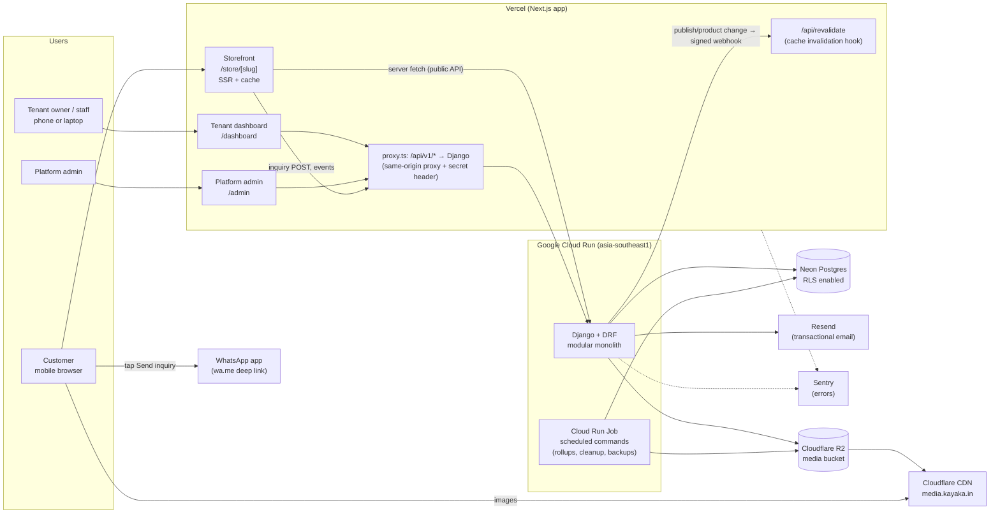
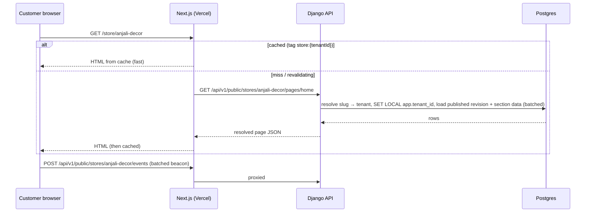
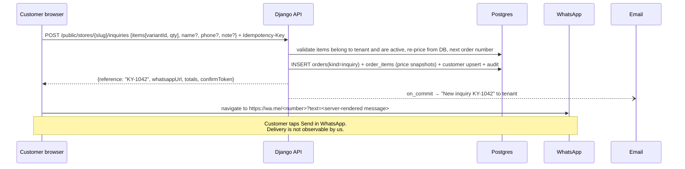
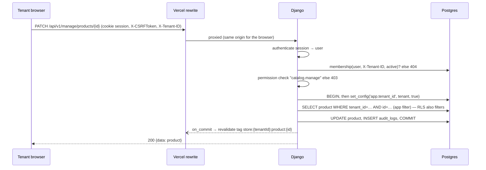
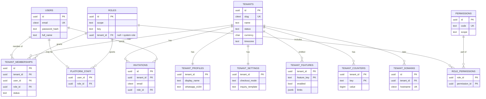
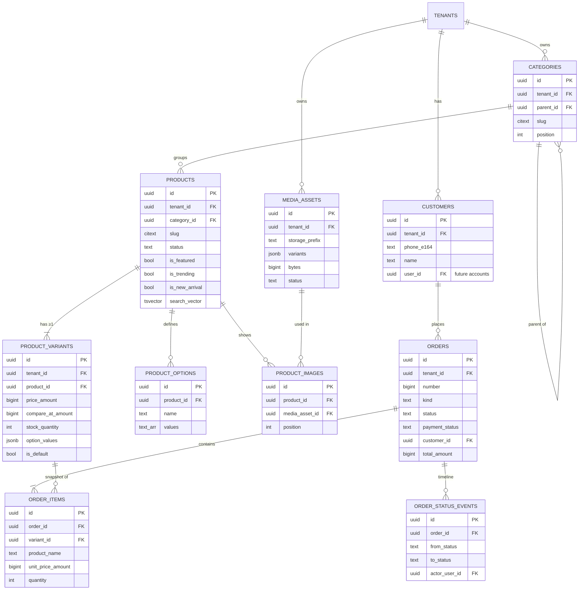
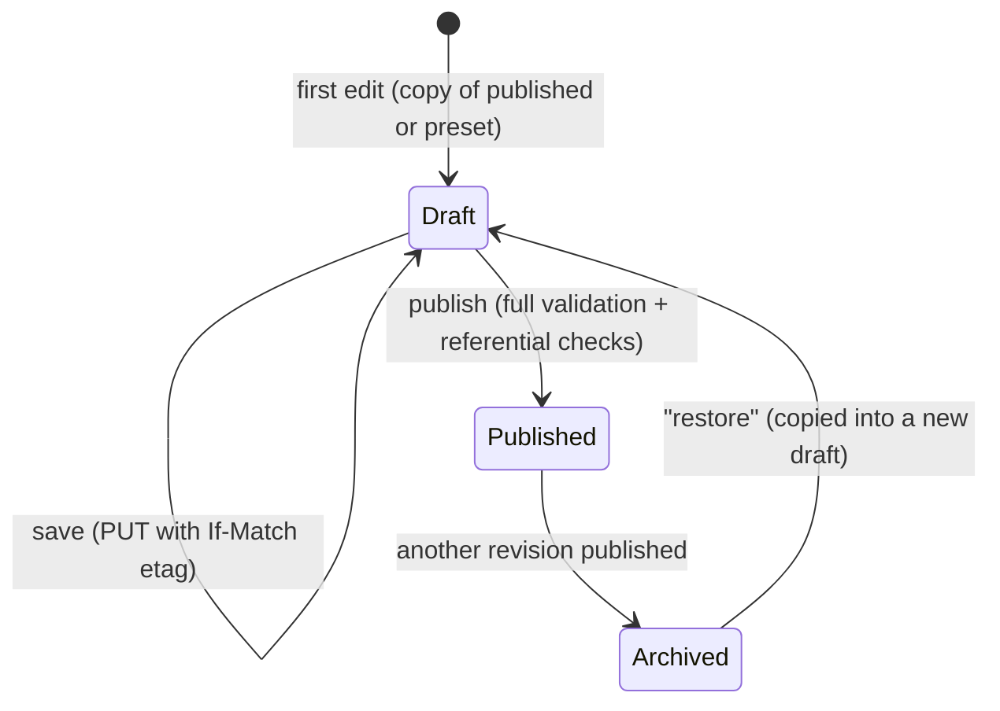
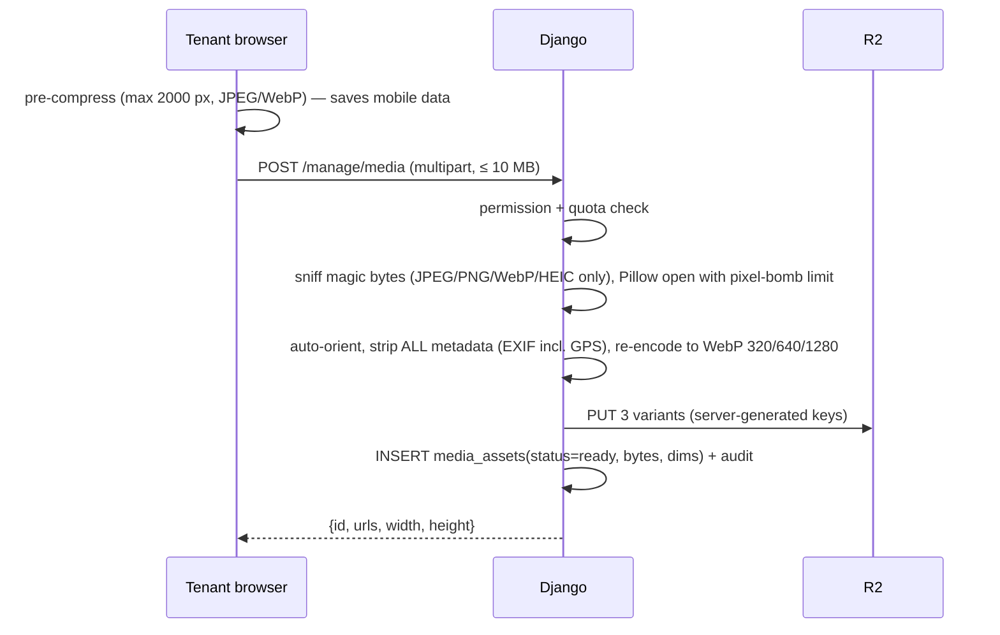
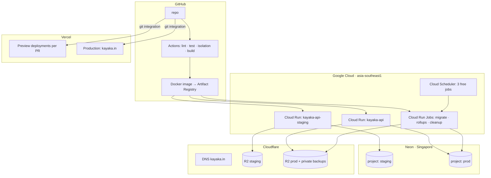

# Kayaka — Architecture & Product Blueprint

| | |
|---|---|
| Status | **Approved** 2026-09-30. Payments are out of the initial implementation. Decisions are recorded as ADRs in [`docs/adr/`](../adr/README.md). |
| Version | 1.0 · 2026-09-30 |
| Supersedes | Initial draft (Next.js-only + Supabase + Prisma). Revised because the stated requirements (RBAC, audit, modular monolith, isolation testing, learning goals) are a better fit for a Django backend. See §G. |
| Working name | Kayaka (repo name). Easy to change later. |

---

## 0. Summary of where this blueprint deviates from the brief

The brief is strong. These are the places where I deliberately chose differently, with the reasoning in the referenced section.

| # | Brief said / implied | Blueprint decision | Why | § |
|---|---|---|---|---|
| 1 | Separate `inquiries` and `orders` tables | **One `orders` table** with `kind = inquiry \| order` | An inquiry is an order that hasn't been paid online yet. One table means one inbox, one status flow, one analytics source, and no migration when a tenant turns payments on. The UI still says "Inquiries". | H, O |
| 2 | `carts` / `cart_items` tables | **Client-side cart for MVP** (per-tenant, persisted in browser). Server re-prices at inquiry time. | Anonymous customers + server carts = session management, cleanup jobs, and more writes on a 0.5 GB database, for no MVP benefit. Add server carts when customer accounts arrive. | H, J |
| 3 | `storefront_pages` + `storefront_sections` rows | **Versioned JSON document per revision**, validated by JSON Schema | Atomic publish, trivial rollback, exact preview, and it maps 1:1 to a future visual builder's state. Section rows make versioning painful. | K |
| 4 | Trending / featured / new-arrival sections as separate types | **One `product_collection` section** with a data *source* (flag, category, newest, manual) | Five near-identical components collapse into one. Fewer bugs, more flexibility for tenants. | K |
| 5 | `inventory` table | **Stock lives on the variant** in MVP | A separate inventory table only earns its keep with multiple locations or stock ledgers. | H |
| 6 | "Introduce variants cleanly later" | **Every product has ≥1 variant from day one** (default variant hidden in UI) | This is the one thing that is expensive to retrofit. Price and stock always live on variants, so adding sizes/colours later is a UI change, not a data migration. | H |
| 7 | Redis + Celery (optional) | **Not in MVP.** Django Tasks API (`django-tasks` DB backend) + scheduled Cloud Run Jobs | No free always-on worker hosting exists that is worth the operational cost. Postgres is enough for the job volume we'll have. | I |
| 8 | JWT implied | **Session cookies via a same-origin proxy** (Next.js forwards `/api/v1/*` to Django) | httpOnly cookies can't be stolen by XSS, no CORS, no token refresh logic. Token auth is added later for a mobile app without changing the backend design. | L |
| 9 | Backend on "free/low-cost cloud" | **Google Cloud Run** (not Render) | Render's free tier now has ~50 s cold starts and 5 GB/month bandwidth. Cloud Run scales to zero with ~2–5 s cold starts and a real free quota. | T, U |
| 10 | Categories, campaigns, discounts, notifications as separate modules | **Fewer, larger modules** (`catalog`, `promotions`, `messaging`) | Module boundaries should follow business capabilities, not tables. | I |
| 11 | WhatsApp inside a "notification" abstraction | **Two different abstractions**: `ContactChannel` (customer → tenant handoff, e.g. wa.me) and `NotificationService` (platform → people, e.g. email) | A wa.me link isn't a notification the server sends. It's a handoff the customer performs. Mixing them produces a leaky interface. | O |
| 12 | Payments: none or gateway | **Three tiers**: none → manual UPI (zero integration) → gateway | Manual UPI (`upi://` intent + QR) is how Indian small sellers actually get paid today, and it costs nothing. | P |
| 13 | `success: false` in error envelope | **HTTP status code + `error` object** | A `success` flag duplicates the status code. | R |

---

## A. Product Understanding

Kayaka is a **multi-tenant SaaS that gives a small entrepreneur a persistent, branded, searchable online store in minutes**, where the default "checkout" is a structured WhatsApp conversation rather than a payment.

It is not an Amazon clone. Amazon is a marketplace: customers belong to the platform, and sellers compete on it. Kayaka is closer to a Shopify for home businesses: **each store belongs to the entrepreneur**, customers visit *her* store through *her* link, and the platform stays mostly invisible. The shopping experience borrows familiar marketplace patterns (grid, search, cart) because customers already know them.

The core loop:

```
Entrepreneur adds products once  →  shares store/product links on WhatsApp Status & Instagram
        ↑                                                  ↓
Insights ("23 people searched 'jhumka'")  ←  Customer browses, searches, adds to cart
        ↑                                                  ↓
Inquiry inbox with reference numbers   ←   "Send inquiry" opens WhatsApp with a pre-filled order
```

Kayaka **complements** WhatsApp and Instagram rather than replacing them. Status and Stories remain the discovery channel. Kayaka becomes the place they link to, and the memory they lack.

---

## B. Problems Being Solved

**Entrepreneurs**
- Products vanish when a Status expires (24 h) or a post sinks in the feed. There is no catalog.
- They answer the same questions repeatedly ("price?", "available?", "other colours?").
- Orders arrive as unstructured chats. No inquiry list, no reference numbers, easy to lose track.
- No data: which products get attention, what customers search for, what the store is missing.
- Websites feel expensive and technical. Marketplaces take commissions and own the customer.

**Customers**
- Can't browse the full range or see older products.
- Can't search or filter.
- Have to screenshot a Status and type out what they want.
- No clear price or availability before starting a conversation.

**Platform owner**
- Needs to onboard and support many small tenants cheaply.
- Needs visibility into platform health, growth, and usage (for future pricing and plans).
- Needs strong isolation guarantees. One cross-tenant data leak would destroy trust.
- Needs to run on free tiers while proving the idea.

---

## C. User Personas

**Platform Admin — "Charan" (you)**
Technical. Wants a dense, searchable console: tenants, health, growth, usage, audit trail, and support tools. Wears every platform hat at first (super admin, support, analyst). Other people may join later, so platform roles exist from the start.

**Entrepreneur / Tenant Owner — "Anjali" (your cousin)**
Runs a jewellery and décor business from home. Very fluent with WhatsApp and Instagram, not with software. Does most work **on her phone**, often in short bursts between customers. Photographs products on her phone. Thinks in "items, prices, offers, customers", not "SKUs, entities, configurations". Measures success in inquiries. May later add a family member as staff.

**Customer — "Priya"**
Sees a Status or Instagram story, taps the link, and lands on the store on a mid-range Android phone over 4G. Will leave if the page is slow or asks her to sign up. Wants to see photos, price, and options, then message the seller with minimal typing. Trusts WhatsApp because the seller is a known person.

---

## D. Functional Requirements

Priority: **M** = MVP must-have, **S** = should-have (MVP+ / soon after), **L** = later.

### D.1 Platform Admin

| ID | Requirement | P |
|---|---|---|
| PA-01 | Secure login (MFA before public launch) | M (MFA: S) |
| PA-02 | Create tenant and invite owner by email | M |
| PA-03 | List, search, and filter tenants (status, created date, activity) | M |
| PA-04 | Approve, suspend, or reactivate a tenant (suspended store shows "unavailable") | M |
| PA-05 | Tenant detail: profile, owner, product count, storage used, last activity, 30-day metrics | M |
| PA-06 | Platform dashboard: total and active tenants, products, visitors, product views, inquiries, tenant growth | M |
| PA-07 | Manage feature entitlements per tenant (payments allowed, product limit, storage quota) | S |
| PA-08 | Platform-wide audit log viewer with filters | S |
| PA-09 | Storage usage per tenant and in total | S |
| PA-10 | Platform health page (DB reachable, last job runs, error rate link) | S |
| PA-11 | Manage theme presets available to tenants | S |
| PA-12 | Support view of tenant data (read-only, audited) and later impersonation | L |
| PA-13 | Plans and subscriptions | L |

### D.2 Tenant (Entrepreneur)

| ID | Requirement | P |
|---|---|---|
| TN-01 | Accept invite, set password, log in, reset password | M |
| TN-02 | Guided store setup: name, logo, WhatsApp number, first products, share link | M |
| TN-03 | Business profile: name, tagline, description, logo, contact info, address, social links, WhatsApp number | M |
| TN-04 | Product CRUD: name, description, price, compare-at ("original") price, images (multiple, reorder), category, tags, status (draft / active / archived) | M |
| TN-05 | Mobile-first **quick add**: photos → name → price → publish in under a minute | M |
| TN-06 | Flags: featured, trending, new arrival | M |
| TN-07 | Stock quantity (optional tracking) and "out of stock" display | M |
| TN-08 | Categories: create, edit, delete, reorder, optional image | M |
| TN-09 | Inquiry inbox: list, filter by status, detail with items and snapshot prices, change status (new → contacted → confirmed → completed / cancelled), private notes | M |
| TN-10 | Look up an inquiry by reference number (e.g. `KY-1042`) quoted in a WhatsApp chat | M |
| TN-11 | Email notification on new inquiry | M |
| TN-12 | Customers list built from inquiries: name, phone, inquiry count, last inquiry, history | M |
| TN-13 | Storefront customization: choose theme preset, adjust colours / fonts / shape, add / remove / reorder / configure home sections, preview, publish, roll back | M (form-based) |
| TN-14 | Insights: visitors, product views, top products, top searches, **searches with no results**, add-to-cart count, inquiries, WhatsApp handoffs, 7- and 30-day trends | M (basic) |
| TN-15 | Configure checkout: WhatsApp message template, whether to ask for customer name / phone | M |
| TN-16 | Product variants with options (Size, Colour) | S |
| TN-17 | Share kit: copy store or product link, product share card image for WhatsApp Status / Instagram, store QR code poster | S |
| TN-18 | Manual UPI payments: UPI ID / QR on checkout, mark inquiry as paid | S |
| TN-19 | Team members with roles (Manager, Staff, Marketing) | S |
| TN-20 | Duplicate product, bulk actions (activate, archive, flag) | S |
| TN-21 | Discounts (percentage / fixed, scheduled, on products or categories) | L |
| TN-22 | Campaigns: scheduled banner + product selection + discount + campaign landing section + performance | L |
| TN-23 | Online payment gateway (tenant's own account) | L |
| TN-24 | Custom domain / subdomain | L |
| TN-25 | Visual drag-and-drop builder with live preview | L |
| TN-26 | Bulk import (CSV, multi-photo → drafts) | L |

### D.3 Customer

| ID | Requirement | P |
|---|---|---|
| CU-01 | Open a store via `/store/{slug}` with no login | M |
| CU-02 | Home page rendered from the tenant's published configuration | M |
| CU-03 | Browse categories and product lists with pagination, sort, and filters (category, price range, in stock) | M |
| CU-04 | Search with typo-tolerant / partial matching | M |
| CU-05 | Product page: swipeable image gallery, price with strike-through compare-at, stock state, description, variant selection (when variants exist) | M |
| CU-06 | Add to cart, change quantity, remove. Cart persists per store on the device. | M |
| CU-07 | **One-tap "Ask on WhatsApp"** from a product page (no cart required) | M |
| CU-08 | Send inquiry from cart: optional name / phone / note → WhatsApp opens with pre-filled message containing a reference number | M |
| CU-09 | Inquiry confirmation page with reference and "Open WhatsApp again" | M |
| CU-10 | Contact / social section: WhatsApp, Instagram, call | M |
| CU-11 | Pay via UPI when the tenant enables it | S |
| CU-12 | Wishlist (device-local first) | L |
| CU-13 | Customer accounts, order history, order tracking | L |
| CU-14 | Online payment checkout | L |

### D.4 Platform (cross-cutting)

| ID | Requirement | P |
|---|---|---|
| PL-01 | Multi-tenancy with isolation enforced at API, service, query, **and database (RLS)** layers | M |
| PL-02 | RBAC with permission codes and seeded roles; enforcement on every endpoint | M |
| PL-03 | Audit log of security-relevant and business-relevant changes | M |
| PL-04 | Image upload pipeline with validation, re-encoding, and resizing to object storage | M |
| PL-05 | Analytics event ingestion and daily rollups | M |
| PL-06 | SEO: server rendering, metadata, OpenGraph, JSON-LD, sitemaps | M |
| PL-07 | Spam and abuse protection on public write endpoints (rate limits, bot challenge) | M |
| PL-08 | Automated tenant isolation test suite that fails the build | M |
| PL-09 | Nightly logical backups in addition to provider backups | M |

---

## E. Non-Functional Requirements

| Area | Requirement | MVP target |
|---|---|---|
| **Security** | Tenant isolation defense-in-depth; OWASP ASVS L1 baseline; secrets never in git; MFA for platform staff before public launch | Zero cross-tenant access in the isolation suite; CI secret scanning |
| **Performance** | Storefront served from cache; pre-sized images; minimal client JS | Storefront LCP < 2.5 s on 4G mid-range Android; CLS < 0.1; INP < 200 ms; first-load JS on storefront ≤ ~150 KB gzip |
| | API | p95 < 300 ms warm for dashboard reads; cold start tolerated (≤ 5 s) |
| **Scalability** | Stateless API instances; tenant-leading indexes; rollups for analytics | Comfortable to ~100 tenants / ~50k products / low millions of events on the free/cheap tier; clear upgrade path beyond |
| **Availability** | Best effort on free tier; storefront keeps serving cached pages if the API is cold or down | No SLA in MVP. Storefront degrades gracefully. |
| **Durability** | Provider backups + nightly `pg_dump` to object storage | RPO ≤ 24 h, restore drill documented |
| **Maintainability** | Modular monolith with enforced import boundaries; typed API contract; ADRs for decisions | CI enforces lint, types, and module contracts |
| **Accessibility** | Target WCAG 2.2 AA for storefront and dashboard; theme contrast enforced | axe checks in E2E. Full validation needs manual testing with assistive technologies and an expert review. |
| **SEO** | SSR / ISR storefront, canonical URLs, structured data, per-store sitemaps | Product pages pass Google Rich Results test |
| **Privacy** | Minimal PII; no raw IPs in analytics; privacy policy and terms; India DPDP Act readiness | PII fields documented; analytics anonymous |
| **Cost** | $0–few $/month until real traction | Budget alerts at $1 and $5 |
| **Portability** | Avoid vendor-only features where cheap to do so | Next.js app deployable to Vercel or Cloudflare; API is a plain container |

---

## F. System Architecture

### F.1 Context and containers



### F.2 Key request flows

**Storefront page view (hot path, mostly cached)**



**Inquiry handoff**



**Dashboard request with tenant context**



---

## G. Technology Stack Evaluation

### G.1 Honest evaluation of your proposed stack

| Your choice | Verdict | Notes |
|---|---|---|
| Next.js + TypeScript | ✅ Keep | Best fit for an SEO-critical, server-rendered storefront plus app-like dashboards. |
| Tailwind + shadcn/ui | ✅ Keep | CSS variables make per-tenant theming natural; shadcn components are accessible (Radix) and owned in-repo. |
| Framer Motion | ⚠️ Keep, restricted | Now published as `motion`. Use for dashboard polish and a few storefront micro-interactions via `LazyMotion`. Prefer CSS transitions on the storefront to protect bundle size. |
| TanStack Query | ✅ Keep | Dashboard and admin server state. Not needed on the storefront, which uses server components. |
| Zustand | ✅ Keep, small scope | Cart (persisted per tenant) and a little UI state. Not a general store. |
| Django + DRF | ✅ Keep | See G.2. |
| PostgreSQL | ✅ Keep | Relational data, RLS, full-text + trigram search, JSONB for storefront docs. No reason for MongoDB. |
| Docker | ✅ Keep for backend | Cloud Run needs a container; docker compose gives dev parity. The frontend doesn't need Docker. |
| GitHub Actions | ✅ Keep | |
| Redis + Celery | ❌ Not in MVP | No free always-on worker hosting worth using; job volume is tiny. Django Tasks API + DB backend + scheduled jobs covers it. Revisit when you need sub-minute async at volume. |
| Cloudflare R2 | ✅ Keep | Zero egress fees, S3 API, CDN in front. |
| Vercel | ✅ Keep, with a caveat | Hobby tier is **non-commercial only**. Fine for building and piloting. Plan the switch (Pro or Cloudflare Workers via OpenNext) before real commercial use. |

### G.2 Django vs Next.js-only (why I changed my earlier recommendation)

My earlier draft proposed Next.js full-stack + Supabase + Prisma. With your full requirements, Django is the better backend:

- **Pros:** mature ORM and migrations; DRF serializers, permissions, and throttling; Django admin as a free back-office tool; excellent testing (pytest-django); a natural modular monolith (apps); Python for future AI and analytics work; strong security defaults (CSRF, XSS escaping, password hashing, clickjacking headers).
- **Cons:** two deployables; cold starts on scale-to-zero hosting; types must be bridged (solved by OpenAPI → TypeScript generation); auth cookies across origins (solved by the same-origin proxy).

The cons have clean mitigations. The pros compound over the project's life.

### G.3 Final stack, per component

| Component | Choice | Why | Alternatives | Pros | Cons | When |
|---|---|---|---|---|---|---|
| Frontend framework | **Next.js 16 (App Router), React 19, TypeScript** | SSR/ISR for SEO, server components keep storefront JS small, route groups separate the three apps | Remix/React Router 7, Astro (storefront) + SPA | One app for 3 surfaces, huge ecosystem | Framework churn; caching model needs care | MVP |
| Styling | **Tailwind CSS v4 + shadcn/ui (Radix)** | Theming via CSS variables; accessible primitives | Chakra, MUI, Mantine | Small CSS, owned components | Utility-class verbosity | MVP |
| Animation | **Motion (Framer Motion)** | Polish | CSS only | Nice UX | Bundle weight if overused | MVP (limited) |
| Server state | **TanStack Query v5** | Caching, retries, mutations for dashboards | SWR | Mature devtools | Another concept to learn | MVP |
| Client state | **Zustand** (+ persist) | Cart, UI toggles | Jotai, Context | ~1 KB, simple | None significant | MVP |
| Forms/validation | **React Hook Form + Zod** | Performant forms, typed schemas | Formik, Conform | Great DX | — | MVP |
| API client | **openapi-typescript + openapi-fetch** from DRF schema | End-to-end types across Python ↔ TS | Orval, hand-written | Contract drift caught in CI | Codegen step | MVP |
| Charts | **Recharts** | Simple insights charts | Tremor, Chart.js | Easy | Heavier; dashboard only | MVP |
| Drag & drop | **dnd-kit** | Section and image reordering | react-beautiful-dnd (unmaintained) | Accessible, keyboard support | — | MVP (sortable lists), L (builder) |
| Backend | **Python 3.14 (3.13 fallback), Django 5.2 LTS, DRF 3.17** | LTS until Apr 2028; DRF 3.17 supports 5.2 and 6.0 | Django 6.x, FastAPI, NestJS | Stability, ecosystem | 5.2 lacks built-in Tasks (backport package covers it) | MVP |
| Auth | **django-allauth (headless mode)** | Signup, login, email verification, password reset, MFA (TOTP), social login, both cookie (browser) and token (future mobile) clients | Hand-rolled, dj-rest-auth + simplejwt | Battle-tested flows | Its URL structure is opinionated | MVP |
| Password hashing | **Argon2** | Current best practice | PBKDF2 (Django default) | Memory-hard | Native dependency | MVP |
| API schema | **drf-spectacular** (OpenAPI 3.1) | Types for frontend, docs | drf-yasg | Maintained | Annotations needed on custom views | MVP |
| JSON casing | **djangorestframework-camel-case** | camelCase on the wire, snake_case in Python | Manual | Natural TS | Small overhead | MVP |
| Background jobs | **Django Tasks API via `django-tasks` (DB backend)** + **Cloud Run Jobs** triggered by **Cloud Scheduler** | No Redis; code is forward-compatible with `django.tasks` in Django 6 | Celery + Redis, Procrastinate, django-q2 | Zero extra infra | Not real-time (minute-level) | MVP (scheduled), S (queued tasks) |
| Database | **PostgreSQL 17+ on Neon** | Scale-to-zero with sub-second resume (no weekly pause), branching for staging and previews, no card required | Supabase, Aiven, self-hosted | Serverless, branching | 0.5 GB/project, 5 GB transfer/project on free | MVP |
| DB extensions | `pg_trgm`, `unaccent`, `citext` | Search, case-insensitive emails and slugs | — | Built in | — | MVP |
| Search | **Postgres FTS + trigram** behind `SearchBackend` | Good enough for catalogs of thousands per tenant | Meilisearch, Typesense, OpenSearch | No new infra | Weaker relevance tuning | MVP (Meilisearch: L) |
| Object storage | **Cloudflare R2** + CDN custom domain, behind `StorageService` | Zero egress, S3-compatible | Supabase Storage, S3, Backblaze B2 | Cheap at scale | Needs a domain on Cloudflare for production public URLs | MVP |
| Image processing | **Pillow (+ pillow-heif)** server-side; browser pre-compression | Re-encode (security), strip EXIF (privacy), pre-sized WebP variants | Cloudflare Images, imgproxy, Vercel Image Optimization | Avoids Vercel's 5k transformation/month cap | CPU on upload | MVP |
| Cache | **Next.js tag-based cache** (storefront) + **Django DB/locmem cache** (throttles, slug lookups) | No Redis needed | Upstash Redis (free 500K commands/mo) | Zero infra | Per-instance locmem | MVP (Upstash: S if multi-instance throttling needed) |
| Email | **Resend** | Simple API, free tier, React-email friendly | Brevo, Amazon SES, Postmark | Easy | Needs verified domain | MVP |
| Bot protection | **Cloudflare Turnstile** on inquiry form | Free, privacy-friendly | hCaptcha, reCAPTCHA | Invisible mostly | Extra script | MVP |
| Errors | **Sentry** (both apps) | Free developer tier | GlitchTip, Better Stack | Great context | Quotas | MVP |
| Logs | **Structured JSON logs → Cloud Logging**; Vercel runtime logs | Free ingestion quota | Better Stack, Axiom | Built in | Vercel Hobby keeps only 1 h of logs | MVP |
| Frontend hosting | **Vercel Hobby** → Pro or Cloudflare Workers (OpenNext) for commercial use | Zero-config Next.js | Cloudflare Workers, Netlify | Best Next.js support | Non-commercial on Hobby | MVP |
| Backend hosting | **Google Cloud Run** (request-based billing, min 0, max 2) | Real free quota, fast cold starts, containers | Render free, Koyeb free, Fly.io | Scales to zero, good DX | Needs a billing account (card); APAC egress costs cents | MVP |
| Package mgmt | **uv** (Python), **pnpm** (JS) | Fast and reproducible | pip/poetry, npm | Lockfiles | — | MVP |
| Quality | **ruff**, **mypy + django-stubs** (gradual), **import-linter**, **ESLint**, **Prettier**, **gitleaks**, Dependabot, pip-audit | Enforced in CI | — | — | Initial setup time | MVP |
| Testing | **pytest, pytest-django, factory_boy**; **Vitest + Testing Library + MSW**; **Playwright + @axe-core/playwright** | See §35 of brief | — | — | — | MVP |
| Payments | `PaymentProvider` interface; **manual UPI** first; **Razorpay** adapter (tenant's own account) | India-first; platform never holds funds | Stripe, Cashfree, PhonePe PG | Provider-agnostic | Credential custody | S (UPI) / L (gateway) |

**Deliberately not used:** Kubernetes, microservices, Kafka, ClickHouse, Elasticsearch, GraphQL, Redis/Celery (MVP), Prisma (the frontend doesn't touch the DB), Supabase Auth (Django owns identity).

---

## H. Database Architecture

### H.1 Conventions (apply to every table unless noted)

- **Primary keys:** `id uuid` generated in the app as **UUIDv7** (time-ordered, index-friendly, not enumerable). High-volume append tables (`analytics_events`, `audit_logs`) use `bigint identity`.
- **Tenant ownership:** every tenant-owned table has `tenant_id uuid NOT NULL` → `tenants.id`, is covered by RLS, and has `tenant_id` as the **leading column** of its main indexes.
- **Same-tenant foreign keys:** critical child → parent references use **composite FKs** `(tenant_id, parent_id) → parent(tenant_id, id)`. The database then guarantees that a product can't point at another tenant's category, even if application code has a bug. Django doesn't model composite FKs natively; they are added as `UNIQUE (tenant_id, id)` + raw-SQL constraints in migrations.
- **Timestamps:** `created_at`, `updated_at` as `timestamptz` (UTC). Tenant timezone is used only for display and daily analytics buckets.
- **Money:** `bigint` in **minor units** (paise) + tenant `currency` (`INR` default). Never floats.
- **Soft delete:** only where history matters (`products.archived_at`, `tenants.status`). Orders keep snapshots, so hard deletes elsewhere are safe.
- **Enums:** Postgres `text` + `CHECK` constraint (Django `TextChoices`). Easier to migrate than native enums.
- **JSONB:** only for genuinely document-shaped data (storefront documents, variant option values, event properties, audit diffs). Validated before write.

### H.2 ER diagrams

**Identity, access, tenancy**



**Catalog, customers, orders, media**



**Storefront, analytics, audit, promotions, payments**

```mermaid
erDiagram
    TENANTS ||--|| STOREFRONTS : has
    STOREFRONTS ||--o{ STOREFRONT_REVISIONS : versions
    THEME_PRESETS ||--o{ STOREFRONT_REVISIONS : "based on"
    TENANTS ||--o{ ANALYTICS_EVENTS : emits
    TENANTS ||--o{ ANALYTICS_DAILY_STORE : rolled
    TENANTS ||--o{ ANALYTICS_DAILY_PRODUCT : rolled
    TENANTS ||--o{ ANALYTICS_DAILY_SEARCH : rolled
    TENANTS ||--o{ AUDIT_LOGS : "scoped (nullable)"
    TENANTS ||--o{ DISCOUNTS : "later"
    DISCOUNTS ||--o{ DISCOUNT_PRODUCTS : targets
    DISCOUNTS ||--o{ DISCOUNT_CATEGORIES : targets
    TENANTS ||--o{ CAMPAIGNS : "later"
    CAMPAIGNS ||--o{ CAMPAIGN_PRODUCTS : features
    TENANTS ||--o{ PAYMENT_CONFIGS : "later"
    ORDERS ||--o{ PAYMENTS : "later"
    PAYMENTS ||--o{ PAYMENT_EVENTS : "webhook log"

    STOREFRONTS { uuid tenant_id PK
        uuid draft_revision_id FK
        uuid published_revision_id FK }
    STOREFRONT_REVISIONS { uuid id PK
        uuid tenant_id FK
        int number
        int schema_version
        jsonb document
        text status }
    THEME_PRESETS { uuid id PK
        text key UK
        jsonb tokens }
    ANALYTICS_EVENTS { bigint id PK
        uuid tenant_id FK
        text event_type
        uuid visitor_id
        timestamptz occurred_at }
    ANALYTICS_DAILY_STORE { uuid tenant_id PK
        date day PK }
    ANALYTICS_DAILY_PRODUCT { uuid tenant_id PK
        date day PK
        uuid product_id PK }
    ANALYTICS_DAILY_SEARCH { uuid tenant_id PK
        date day PK
        text query PK }
    AUDIT_LOGS { bigint id PK
        uuid tenant_id FK
        uuid actor_user_id FK
        text action
        jsonb changes }
    DISCOUNTS { uuid id PK
        uuid tenant_id FK
        text type
        bigint value }
    CAMPAIGNS { uuid id PK
        uuid tenant_id FK
        timestamptz starts_at
        timestamptz ends_at }
    PAYMENT_CONFIGS { uuid id PK
        uuid tenant_id FK
        text provider
        bytea credentials_encrypted }
    PAYMENTS { uuid id PK
        uuid tenant_id FK
        uuid order_id FK
        text provider
        text status }
    PAYMENT_EVENTS { uuid id PK
        text provider_event_id UK }
```



### H.3 Tables in detail

Legend: 🟢 MVP · 🟡 Should · ⚪ Later. **RLS** = tenant row-level security applies.

#### Identity & access

**🟢 users** — global identity (a person can belong to several tenants).
`id`, `email citext UNIQUE`, `password` (Argon2 via Django), `full_name`, `phone_e164 NULL`, `is_active`, `email_verified_at`, `last_login`, `date_joined`.
Custom `AUTH_USER_MODEL` from the first migration (this can't be changed cheaply later). No RLS (global). Only exposed through `/me` and tenant-scoped member lists.

**🟢 permissions** — catalog of permission codes, seeded from code.
`id`, `code UNIQUE` (e.g. `catalog.manage`), `scope` (`platform` | `tenant`), `description`.

**🟢 roles** — named bundles of permissions.
`id`, `scope`, `key` (`owner`, `manager`, `staff`, `marketing`, `super_admin`, …), `name`, `tenant_id NULL` (NULL = system role; non-null = future custom tenant role), `is_system`. `UNIQUE (scope, tenant_id, key)` with NULLS NOT DISTINCT.

**🟢 role_permissions** — `(role_id, permission_id)` PK.

**🟢 platform_staff** — who can use `/admin`.
`user_id PK FK`, `role_id FK` (platform-scope role), `mfa_required bool`, `created_by`.

**🟢 tenant_memberships** — user ↔ tenant with a role. **RLS.**
`id`, `tenant_id`, `user_id`, `role_id` (tenant-scope role), `status` (`active` | `suspended` | `removed`), `invited_by`. `UNIQUE (tenant_id, user_id)`; index `(user_id)`.
One role per membership in MVP. Multiple roles later = a join table, with no API change.

**🟢 invitations** — **RLS.**
`id`, `tenant_id NULL` (NULL = platform staff invite), `email`, `role_id`, `token_hash` (store the hash, email the raw token), `expires_at`, `accepted_at`, `invited_by`. Index `(token_hash)`.

#### Tenancy

**🟢 tenants** — the business account. No RLS (it's the anchor), but only exposed via tenant resolution or platform APIs.
`id`, `slug citext UNIQUE` (3–40 chars, `[a-z0-9-]`, reserved-word blocklist), `name`, `status` (`pending` | `active` | `suspended` | `archived`), `currency char(3) DEFAULT 'INR'`, `timezone DEFAULT 'Asia/Kolkata'`, `locale DEFAULT 'en-IN'`, `approved_at`, `suspended_reason`.

**🟢 tenant_profiles** — public business information (1:1). **RLS.**
`tenant_id PK`, `display_name`, `tagline`, `description` (sanitized), `logo_asset_id`, `favicon_asset_id`, `email`, `phone_e164`, `whatsapp_e164`, `address_line1/2`, `city`, `state`, `postal_code`, `country DEFAULT 'IN'`, `social_links jsonb` (validated `{instagram, facebook, youtube}`, https only), `business_hours jsonb NULL`.

**🟢 tenant_settings** — **preferences the tenant controls** (1:1). **RLS.**
`tenant_id PK`, `checkout_mode` (`whatsapp_inquiry` | `payment` | `both`), `inquiry_template text` (token-based, see §O), `inquiry_ask_name bool`, `inquiry_ask_phone bool`, `show_stock_count bool`, `upi_id NULL`, `upi_payee_name NULL`, `notify_email_on_inquiry bool`.

**🟢 tenant_features** — **entitlements the platform controls.** **RLS** (tenants can read, only platform can write).
`(tenant_id, feature_key) PK`, `enabled`, `limits jsonb` (e.g. `{"maxProducts": 500, "storageMb": 500}`), `updated_by`.
Keys: `payments`, `manual_upi`, `custom_domain`, `team_members`, `campaigns`, `storage`, `catalog`.
**Effective capability = entitlement AND preference.** Example: a tenant can pick `checkout_mode = payment` only if `tenant_features.payments.enabled`.

**🟢 tenant_counters** — per-tenant human-friendly sequences. **RLS.**
`(tenant_id, key) PK`, `value bigint`. `UPDATE … SET value = value + 1 RETURNING value` inside the order transaction gives `KY-1001, KY-1002…` per tenant without cross-tenant gaps or leakage of platform-wide volume.

**⚪ tenant_domains** — `id`, `tenant_id`, `hostname citext UNIQUE`, `kind` (`subdomain` | `custom`), `is_primary`, `verification_token`, `verified_at`, `ssl_status`. Used by host-based routing in Phase 13.

#### Media

**🟢 media_assets** — metadata for files in object storage. **RLS.**
`id`, `tenant_id`, `kind` (`image`), `status` (`processing` | `ready` | `failed` | `deleted`), `storage_prefix` (`t/{tenant_id}/img/{asset_id}/`), `variants jsonb` (`{"sm":{"w":320,"h":400,"key":"…/sm.webp","bytes":…}, "md":…, "lg":…}`), `width`, `height`, `bytes` (sum of stored variants), `mime_original`, `original_filename` (sanitized, display only), `alt_text`, `uploaded_by`, `deleted_at`.
Indexes: `(tenant_id, created_at DESC)`. Storage usage per tenant = `SUM(bytes) WHERE status='ready'`.

#### Catalog

**🟢 categories** — **RLS.**
`id`, `tenant_id`, `parent_id NULL` (composite FK, max depth 2 enforced in the service), `name`, `slug`, `description`, `image_asset_id NULL`, `position int`, `is_active`.
`UNIQUE (tenant_id, slug)`, `UNIQUE (tenant_id, id)` (composite FK target), index `(tenant_id, parent_id, position)`.

**🟢 products** — **RLS.**
`id`, `tenant_id`, `category_id NULL` (composite FK), `name`, `slug`, `short_code` (8-char, stable, used in URLs so renamed products don't break shared links), `description` (sanitized, limited markdown), `status` (`draft` | `active` | `archived`), `is_featured`, `is_trending`, `is_new_arrival`, `tags text[]`, `attributes jsonb` (free-form key/value, e.g. material), `has_variants bool` (UI hint), `position int`, `search_vector tsvector` (trigger-maintained: name A, tags B, category name C, description D; `simple` config + `unaccent`), `published_at`, `archived_at`.
Indexes:
- `UNIQUE (tenant_id, slug)`, `UNIQUE (tenant_id, short_code)`, `UNIQUE (tenant_id, id)`
- `(tenant_id, status, position)` — default listing
- `(tenant_id, category_id, status)` — category pages
- partial `(tenant_id, position) WHERE status='active' AND is_trending` (same for featured and new arrival)
- `GIN (search_vector)`, `GIN (name gin_trgm_ops)`, `GIN (tags)`

Single primary category + tags is deliberate: simpler for the entrepreneur than many-to-many categories. Curated groupings come from flags now and campaigns / collections later.

**🟢 product_variants** — price and stock always live here. **RLS.**
`id`, `tenant_id`, `product_id` (composite FK, `ON DELETE CASCADE`), `title` (`Default`, `Red / M`), `sku NULL`, `option_values jsonb` (`{"Colour":"Red","Size":"M"}`), `price_amount`, `compare_at_amount NULL` (`CHECK > price_amount`), `track_inventory bool`, `stock_quantity int`, `is_default`, `is_active`, `position`, `image_id NULL` (variant-specific image, later).
Indexes: `(product_id, position)`, `UNIQUE (tenant_id, sku) WHERE sku IS NOT NULL`, partial `UNIQUE (product_id) WHERE is_default`.

**🟡 product_options** — `id`, `tenant_id`, `product_id`, `name`, `position`, `values text[]`. Defines the option axes the variant matrix is generated from.

**🟢 product_images** — **RLS.**
`id`, `tenant_id`, `product_id` (composite FK), `media_asset_id` (composite FK), `position`, `alt_text NULL` (falls back to asset alt, then product name). `UNIQUE (product_id, media_asset_id)`, index `(product_id, position)`.

#### Customers

**🟢 customers** — per-tenant customer records (the same person in two stores = two records, by design: the entrepreneur owns her customer list). **RLS.**
`id`, `tenant_id`, `name NULL`, `phone_e164 NULL`, `email NULL`, `user_id NULL` (future customer accounts), `first_seen_at`, `last_order_at`, `orders_count`, `notes` (tenant-private), `marketing_consent bool DEFAULT false`, `last_visitor_id uuid NULL` (links anonymous browsing to the customer after an inquiry).
Indexes: partial `UNIQUE (tenant_id, phone_e164) WHERE phone_e164 IS NOT NULL`, `(tenant_id, last_order_at DESC)`.
If the customer doesn't share a phone, the tenant can attach it later from the WhatsApp chat ("Link customer").

#### Orders (inquiries + orders)

**🟢 orders** — **RLS.**
`id`, `tenant_id`, `number bigint` (from `tenant_counters`), `reference` (`KY-1042`, derived and stored), `kind` (`inquiry` | `order`), `channel` (`whatsapp` | `web`), `status` (`new` | `contacted` | `confirmed` | `completed` | `cancelled`), `payment_status` (`not_required` | `pending` | `paid` | `failed` | `refunded`), `customer_id NULL`, `customer_name`, `customer_phone_e164`, `customer_note`, `shipping_address jsonb NULL`, `currency`, `subtotal_amount`, `discount_amount`, `total_amount`, `visitor_id NULL`, `attribution jsonb` (utm / src / campaign), `message_text` (the WhatsApp text we generated), `confirm_token_hash` (for the public confirmation page), `idempotency_key`, `internal_notes` (tenant-private).
Indexes: `UNIQUE (tenant_id, number)`, `UNIQUE (tenant_id, idempotency_key)`, `(tenant_id, created_at DESC)`, `(tenant_id, status, created_at DESC)`, `(tenant_id, customer_id)`.

**🟢 order_items** — immutable snapshots. **RLS.**
`id`, `tenant_id`, `order_id` (composite FK, cascade), `product_id NULL` and `variant_id NULL` (`ON DELETE SET NULL`), `product_name`, `variant_title`, `sku`, `image_key`, `unit_price_amount`, `compare_at_amount`, `quantity (CHECK 1..99)`, `line_total_amount`.

**🟢 order_status_events** — timeline shown in the inquiry detail. **RLS.**
`id`, `tenant_id`, `order_id`, `from_status`, `to_status`, `actor_user_id NULL`, `note`, `created_at`.

#### Storefront (see §K)

**🟢 theme_presets** — platform-level, no RLS, read-only for tenants.
`id`, `key UNIQUE`, `name`, `tokens jsonb`, `preview_asset_key`, `is_active`, `position`.

**🟢 storefronts** — one per tenant. **RLS.**
`tenant_id PK`, `draft_revision_id NULL`, `published_revision_id NULL`, `updated_at`.

**🟢 storefront_revisions** — **RLS.**
`id`, `tenant_id`, `number int` (per tenant), `schema_version int`, `document jsonb` (≤ 256 KB, enforced), `status` (`draft` | `published` | `archived`), `based_on_revision_id NULL`, `note`, `created_by`, `published_by`, `published_at`, `etag` (content hash for optimistic concurrency).
Indexes: `UNIQUE (tenant_id, number)`, `(tenant_id, status)`. Retention: last 20 non-draft revisions per tenant.

#### Analytics (see §M)

**🟢 analytics_events** — raw, append-only, retained 90 days (configurable). **RLS.**
`id bigint identity`, `tenant_id`, `event_type`, `occurred_at` (client, clamped to ±24 h), `received_at`, `visitor_id uuid`, `session_id uuid`, `product_id NULL`, `category_id NULL`, `order_id NULL`, `campaign_id NULL`, `search_query NULL` (normalized, ≤ 100 chars), `results_count NULL`, `properties jsonb` (≤ 1 KB), `path`, `referrer_host`, `utm_source/medium/campaign`, `device_type`, `country_code`, `is_bot`, `is_internal` (a logged-in tenant member was browsing their own store).
Indexes: `(tenant_id, occurred_at)`, `(tenant_id, event_type, occurred_at)`, `BRIN (received_at)`. Partition by month when the table passes a few million rows.

**🟢 analytics_daily_store** — `(tenant_id, day) PK`, `visitors`, `sessions`, `store_views`, `product_views`, `searches`, `add_to_cart`, `cart_views`, `inquiries`, `whatsapp_handoffs`, `orders`, `inquiry_value_amount`, `paid_amount`. **RLS.**

**🟢 analytics_daily_product** — `(tenant_id, day, product_id) PK`, `views`, `unique_viewers`, `add_to_cart`, `inquired_qty`. **RLS.**

**🟢 analytics_daily_search** — `(tenant_id, day, query) PK`, `count`, `zero_result_count`. **RLS.**

#### Audit (see §Q)

**🟢 audit_logs** — append-only (the runtime DB role has `INSERT, SELECT` only). **RLS** with `tenant_id NULL` visible only to platform context.
`id bigint identity`, `tenant_id NULL`, `actor_type` (`user` | `platform_staff` | `system`), `actor_user_id NULL`, `action` (`catalog.product.updated`), `target_type`, `target_id`, `target_label` ("Pearl Necklace"), `changes jsonb` (`{"variants[default].priceAmount":[59900,49900]}`), `metadata jsonb`, `request_id`, `ip_prefix` (truncated /24), `user_agent_hash`, `created_at`.
Indexes: `(tenant_id, created_at DESC)`, `(target_type, target_id)`, `(actor_user_id, created_at DESC)`.

#### Background jobs

**🟢 django_tasks_*** (from `django-tasks` DB backend) and **🟢 job_runs** — `id`, `job_name`, `started_at`, `finished_at`, `status`, `details jsonb`. Surfaced on the platform health page.

#### Promotions (Phase 11)

**⚪ discounts** — `id`, `tenant_id`, `name`, `type` (`percentage` | `fixed`), `value`, `scope` (`all` | `products` | `categories`), `starts_at`, `ends_at`, `is_active`, `code NULL` (coupons), `priority`, `stackable bool`.
**⚪ discount_products / discount_categories** — `(discount_id, product_id | category_id)`, `tenant_id`, composite FKs. Two tables instead of one polymorphic table keeps real FK integrity.
**⚪ campaigns** — `id`, `tenant_id`, `name`, `slug`, `status` (`draft` | `scheduled` | `active` | `ended`), `starts_at`, `ends_at`, `headline`, `banner_asset_id`, `discount_id NULL`, `utm_campaign`.
**⚪ campaign_products** — `(campaign_id, product_id)`, `tenant_id`, `position`.

#### Payments (Phase 12)

**⚪ payment_configs** — `id`, `tenant_id`, `provider`, `mode` (`test` | `live`), `credentials_encrypted bytea` (Fernet envelope), `webhook_secret_encrypted`, `is_active`. `UNIQUE (tenant_id, provider)`.
**⚪ payments** — `id`, `tenant_id`, `order_id`, `provider`, `provider_order_id`, `provider_payment_id`, `amount`, `currency`, `status` (`created` | `authorized` | `captured` | `failed` | `refunded`), `failure_reason`, `raw_last jsonb`.
**⚪ payment_events** — `id`, `tenant_id`, `provider`, `provider_event_id UNIQUE` (webhook idempotency), `payload jsonb`, `signature_valid`, `processed_at`.

#### Notifications (Phase 10+)

**⚪ notification_outbox** — `id`, `tenant_id NULL`, `channel` (`email` | `whatsapp_api` | `sms` | `push`), `template_key`, `recipient`, `payload jsonb`, `status`, `attempts`, `next_attempt_at`, `provider_message_id`. Transactional outbox; MVP sends email directly on commit.

#### Tables from the brief deliberately *not* created

| Brief table | Decision |
|---|---|
| `inquiries`, `inquiry_items` | Merged into `orders` / `order_items` (`kind = inquiry`) |
| `carts`, `cart_items` | Client-side cart in MVP; add with customer accounts |
| `inventory` | Stock on `product_variants`; add `inventory_levels` + `stock_movements` with multi-location |
| `storefront_pages`, `storefront_sections` | Replaced by `storefront_revisions.document` |
| `themes` | `theme_presets` (platform) + theme tokens inside the tenant's revision document |
| `user_roles` | `tenant_memberships.role_id` + `platform_staff.role_id` |
| `notifications` | `notification_outbox` when async channels arrive |

### H.4 Tenant isolation strategy (database layer)

1. **Shared DB, shared schema, `tenant_id` on every tenant-owned row.** Schema-per-tenant doesn't fit a 0.5 GB free database and makes migrations and analytics harder.
2. **Composite foreign keys** for same-tenant relationships (see H.1).
3. **Row-Level Security** on all tenant-owned tables, as a backstop to the application layer:
   - Two DB roles: `kayaka_owner` (owns tables, runs migrations) and `kayaka_app` (runtime; `NOBYPASSRLS`, not the owner). `FORCE ROW LEVEL SECURITY` is set anyway.
   - Policy per table:
     ```sql
     USING (
       tenant_id = NULLIF(current_setting('app.tenant_id', true), '')::uuid
       OR current_setting('app.platform_access', true) = 'on'
     )
     WITH CHECK (same expression)
     ```
   - **Fail closed:** no tenant context → zero rows visible, inserts rejected.
   - Context is set with `set_config('app.tenant_id', $1, true)` (transaction-local), which is safe with Neon's PgBouncer transaction pooling. Session-level `SET` is banned (a meta-test greps for it).
   - Every request runs in a transaction (`ATOMIC_REQUESTS`). Jobs use a `tenant_context(tenant)` / `platform_context()` context manager.
   - `platform_access` is only set by the platform API surface and platform jobs, after a permission check, and is audited for write operations.
4. **Append-only grants** on `audit_logs` and `analytics_events` for `kayaka_app`.
5. **Meta-test:** a test queries `pg_class`/`pg_policies` and fails if any table with a `tenant_id` column lacks RLS enabled + forced + a policy.

Honest cost of RLS: more moving parts in migrations, tests, and jobs, and a small per-query overhead. For a multi-tenant product whose entire value depends on trust, it's worth it. It's a second lock, not a replacement for the first.

---

## I. Backend Architecture

### I.1 Modules (bounded contexts)

| Module | Responsibility | Owns tables |
|---|---|---|
| `core` | Base models (UUIDv7, timestamps, `TenantOwnedModel`), money, error handling, pagination, request ID, logging, tenancy context + RLS helpers, permission framework, domain event dispatcher, health endpoints | — |
| `accounts` | Users, authentication (allauth headless), sessions, `/me` | users |
| `access` | Roles, permissions, memberships, invitations, platform staff | roles, permissions, role_permissions, tenant_memberships, platform_staff, invitations |
| `tenants` | Tenant lifecycle, profile, settings, entitlements, counters, domains, slug rules | tenants, tenant_* |
| `media` | Uploads, validation, image processing, `StorageService`, quotas, cleanup | media_assets |
| `catalog` | Categories, products, variants, options, images, pricing (`PricingService`), `SearchBackend` | categories, products, product_* |
| `customers` | Per-tenant customer records, linking, history | customers |
| `orders` | Inquiries and orders, checkout service, status machine, references | orders, order_items, order_status_events |
| `storefront` | Revision documents, JSON Schema validation, upcasters, publish/rollback, preview tokens, public page resolver, theme presets | storefronts, storefront_revisions, theme_presets |
| `messaging` | `ContactChannel` (WhatsApp deep link, …) and `NotificationService` (email now; WA API/SMS/push later), templates | notification_outbox (later) |
| `analytics` | Event ingestion, validation, bot filtering, `AnalyticsSink`, rollups, query API | analytics_* |
| `audit` | `audit.record()`, diff helper, query API | audit_logs |
| `platform` | Admin-only use cases: tenant management, platform metrics, usage, health | — (reads others via their selectors) |
| `promotions` ⚪ | Discounts, campaigns, price rules (plugs into `PricingService`) | discounts, campaigns, … |
| `payments` ⚪ | `PaymentProvider` interface, provider adapters, webhooks, payment state machine | payment_* |

**Boundary rule** (enforced by `import-linter` in CI): a module may import another module's `services`, `selectors`, `types`, and `events` only, never its `models` or `api`. This is what keeps future extraction possible.

### I.2 Inside a module

```
catalog/
├── models.py            # Django models (split into a package when large)
├── selectors.py         # read queries; always take `tenant` explicitly; return querysets/DTOs
├── services.py          # write use cases; transactions, validation, audit, domain events
├── pricing.py           # PricingService (effective price; discounts plug in later)
├── search.py            # SearchBackend protocol + PostgresSearchBackend
├── events.py            # domain event dataclasses (ProductUpdated, …)
├── tasks.py             # background tasks (Tasks API)
├── api/
│   ├── manage/          # tenant dashboard surface
│   │   ├── serializers.py
│   │   ├── views.py
│   │   └── urls.py
│   └── public/          # storefront surface — separate serializers (no drafts, no costs, no internal notes)
│       ├── serializers.py
│       ├── views.py
│       └── urls.py
├── admin.py             # Django admin (ops back-office only)
├── migrations/
└── tests/
    ├── test_services.py
    ├── test_selectors.py
    ├── test_api_manage.py
    ├── test_api_public.py
    └── factories.py
```

Patterns chosen on purpose:
- **Services + selectors** (HackSoft-style): business logic lives outside views and serializers, so it's testable and reusable by jobs and the platform module.
- **No repository layer.** The ORM already is one. Selectors give the read abstraction where it's needed.
- **Serializers only translate** HTTP ↔ Python. They don't contain business rules.
- **No Django signals for business logic.** Explicit service calls and an explicit in-process event dispatcher (`on_commit`) are easier to follow and test.
- **Separate public and manage serializers**, so the storefront can never accidentally expose drafts, stock counts (if hidden), or internal notes.

### I.3 Tenancy in the backend

```python
# conceptual — not final code
@dataclass(frozen=True)
class TenantContext:
    tenant: Tenant
    membership: Membership | None      # None on public surface
    permissions: frozenset[str]        # resolved once per request
    surface: Literal["public", "manage", "platform"]
```

- **Public surface** (`/api/v1/public/stores/{slug}/…`): slug → tenant (cached 60 s), must be `active`. Otherwise 404 "store unavailable".
- **Manage surface** (`/api/v1/manage/…`): tenant from the `X-Tenant-ID` header, **validated against the authenticated user's active membership**. No membership → 404 (not 403, so tenant IDs can't be probed). A user with one membership may omit the header.
- **Platform surface** (`/api/v1/platform/…`): requires `platform_staff` + permission; sets `platform_access` for RLS.
- `tenant_id` is **never** read from request bodies. Serializers don't expose it as writable, and services take `ctx.tenant`.
- All related IDs in payloads (category, media asset, product in a section) are resolved through tenant-scoped selectors. Foreign IDs → validation error "not found".

### I.4 Authentication & authorization flow in DRF

1. `SessionAuthentication` (allauth headless browser client) + CSRF enforced.
2. `TenantContextMiddleware`/DRF `initial()` builds `TenantContext` and calls `set_config` inside the request transaction.
3. `HasPermission` DRF permission class reads `required_permissions = {"list": "catalog.view", "create": "catalog.manage", …}` from the view. **A view without a declaration fails a meta-test.**
4. Object lookups go through `selectors.get_product(tenant=ctx.tenant, id=…)` → `NotFound` for cross-tenant IDs.

### I.5 Error handling

A custom DRF exception handler maps every error to the envelope in §R. Unexpected exceptions → `500 INTERNAL_ERROR` with `requestId`, full details to Sentry, never to the client. `DEBUG=False` outside dev, verified by a deploy check (`manage.py check --deploy` in CI).

### I.6 Background work

| Work | MVP mechanism | Later |
|---|---|---|
| Email on new inquiry | `transaction.on_commit` → send with 5 s timeout, failure logged (inquiry still succeeds) | Task queue + outbox with retries |
| Image processing | Synchronous in the upload request (Pillow, ~0.5–1.5 s) | Task after direct-to-R2 upload |
| Storefront cache revalidation | `on_commit` → signed POST to Next `/api/revalidate` (1 retry) | Task with retries |
| Analytics rollups | Cloud Scheduler (hourly) → Cloud Run Job `manage.py rollup_analytics` (idempotent upsert for today + yesterday) | Same, or streaming |
| Cleanup (orphaned media, expired invites, event retention) | Daily job | Same |
| Backups | Nightly GitHub Actions `pg_dump` → encrypted → R2 (private bucket) | Provider PITR on paid tier |
| Queued tasks (bulk import, exports) | — | `django-tasks` DB backend + a worker Cloud Run Job every few minutes |

Everything is written against the Django Tasks API, so moving to Celery / Redis later is a backend swap, not a rewrite.

### I.7 Settings & config

`config/settings/{base,dev,test,prod}.py`, all values from environment variables (validated at startup with `django-environ`). Two DB URLs: `DATABASE_URL` (app role, runtime) and `DATABASE_MIGRATE_URL` (owner role, migrations only). `.env.example` committed, `.env` git-ignored.

---

## J. Frontend Architecture

### J.1 One Next.js app, three surfaces

| Surface | Route | Rendering | Data | Auth |
|---|---|---|---|---|
| Storefront | `/store/[storeSlug]/…` | Server components, tag-cached; small client islands (cart, search box, gallery, inquiry sheet) | Server-side `fetch` to the public API | None (anonymous) |
| Tenant dashboard | `/dashboard/…` | Client-heavy; server components for shells | TanStack Query via the same-origin `/api/v1/*` proxy | Session cookie |
| Platform admin | `/admin/…` | Client-heavy, dense tables | Same | Session cookie + platform role |
| Marketing & auth | `/`, `/login`, `/invite/[token]`, … | Static / server | — | — |

Route groups keep layouts, bundles, and concerns separated. Shared code lives in `components/ui` (shadcn primitives) and `lib`. Storefront code never imports dashboard code (ESLint `no-restricted-imports` rule).

### J.2 Routing

```
/store/[storeSlug]                 home (renderer)
/store/[storeSlug]/c/[categorySlug] category listing
/store/[storeSlug]/p/[productSlug]  product detail — segment is "{slug}-{shortCode}"; stale slugs 301 to canonical
/store/[storeSlug]/search?q=        search results
/store/[storeSlug]/cart             cart (also a drawer)
/store/[storeSlug]/inquiry/[ref]    confirmation (?t=confirmToken)
/store/[storeSlug]/sitemap.xml      per-store sitemap

/dashboard                          "Today" overview + setup checklist
/dashboard/onboarding               guided setup
/dashboard/products (/new, /[id])
/dashboard/categories
/dashboard/inquiries (/[id])
/dashboard/customers (/[id])
/dashboard/store                    customize (theme + sections), preview, publish, history
/dashboard/insights
/dashboard/settings (/profile, /checkout, /team)

/admin, /admin/tenants (/[id]), /admin/analytics, /admin/audit, /admin/settings
```

**Custom-domain readiness:** every storefront link is built with a `storeHref(store, path)` helper, never a hard-coded `/store/${slug}`. In Phase 13, `proxy.ts` (Next 16's replacement for `middleware.ts`) maps `Host: anjalidecor.com` → internal rewrite to `/store/anjali-decor/…`, and `storeHref` returns root-relative paths for domain-served stores. The storefront components don't change.

### J.3 Data layer

- `lib/api/schema.d.ts` generated from the Django OpenAPI schema (`openapi-typescript`). CI fails if it's stale.
- `lib/api/server.ts`: typed client for server components (public API, `next: { tags: [...] }` cache tags, request ID propagation).
- `lib/api/browser.ts`: typed client for the browser (`/api/v1` relative, CSRF header, `X-Tenant-ID` from the active tenant, error normalization to `ApiError`).
- **TanStack Query keys always include `tenantId`**, and the whole query cache is cleared on tenant switch, so one store's data can't flash on another's screen.
- Mutations use optimistic updates only where rollback is trivial (toggle flags, reorder).

### J.4 State

| State | Where |
|---|---|
| Server data (dashboard/admin) | TanStack Query |
| Storefront data | Server components (no client cache needed) |
| Cart | Zustand + `persist`, key `kayaka:cart:{tenantId}` (per-tenant isolation on shared devices), stores `{variantId, qty, addedAt}` only. Prices shown come from a server re-price call. |
| Filters, search, pagination | URL search params (shareable, back-button friendly) |
| Forms | React Hook Form + Zod (schemas mirrored from OpenAPI types) |
| Storefront editor draft | Zustand (with undo/redo in the builder phase) |

### J.5 UX states

Every data view has designed **loading** (skeletons matching final layout to avoid CLS), **empty** (helpful next action, e.g. "Add your first product: it takes a minute"), **error** (plain-language message + retry + request ID in small text), and **offline** (storefront cart still works; inquiry falls back to opening WhatsApp without a reference if the API is unreachable, so the sale isn't lost).

### J.6 Storefront UX specifics (mobile-first)

- Sticky compact header: logo, search icon, cart badge. Category chips scroll horizontally.
- 2-column product grid on mobile, 3–4 on desktop. Fixed aspect-ratio images (no layout shift).
- Product page: swipeable gallery with dots, price with strike-through, variant chips, **sticky bottom bar** with "Add to cart" and **"Ask on WhatsApp"**.
- Cart as a bottom sheet / drawer. Inquiry form in the same sheet: name, phone (optional, remembered on the device), note, then "Send on WhatsApp".
- Touch targets ≥ 44 px, visible focus rings, `prefers-reduced-motion` respected, semantic landmarks, alt text everywhere, keyboard-operable carousels.

### J.7 Tenant dashboard UX specifics

- Plain vocabulary: **Products, Inquiries, Customers, My Store, Insights, Settings**. No "entities", "SKUs" (SKU is an optional advanced field), or "configuration".
- Mobile: bottom tab bar with the four most used destinations. Desktop: sidebar.
- Home = "Today": new inquiries, visitors today, a setup checklist until complete (logo → WhatsApp number → 3 products → customize home → share store link).
- Quick-add product: photos first (the phone camera is the input device), then name, price, category, **Publish**. Everything else is under "More details".
- Insights in sentences, not just charts: "Your store had 312 visitors this week (↑ 18%). Most viewed: Pearl Necklace. 9 people searched for **jhumka** and found nothing — consider adding it."

---

## K. Storefront Engine

### K.1 Concepts

```
Theme presets (platform)  ─┐
                           ├─► Storefront document (per revision) ─► validate ─► publish
Tenant edits (tokens,      │         │
sections, props)          ─┘         ▼
                             Public page resolver (Django): resolves data sources in batch
                                     ▼
                             Renderer (Next.js): registry[type] → component, themed via CSS variables
```

### K.2 Document structure (schema version 1)

```json
{
  "schemaVersion": 1,
  "theme": {
    "preset": "blush",
    "colors": {
      "primary": "#B0476E",
      "onPrimary": "auto",
      "secondary": "#F4E1E8",
      "background": "#FFFDFB",
      "surface": "#FFFFFF",
      "text": "#1F1A1C",
      "mutedText": "#6B6166",
      "border": "#EADDE2",
      "sale": "#C62828"
    },
    "typography": { "headingFont": "playfair-display", "bodyFont": "inter", "scale": "md" },
    "shape": { "radius": "lg", "buttonStyle": "pill", "cardStyle": "elevated" },
    "layout": { "productCardAspect": "4:5", "mobileColumns": 2, "headerStyle": "centered" }
  },
  "header": {
    "announcement": { "enabled": true, "text": "Free delivery above ₹999 in Hyderabad", "link": null },
    "showSearch": true
  },
  "footer": { "showSocial": true, "showAddress": true, "note": "Handmade with love" },
  "pages": {
    "home": {
      "sections": [
        {
          "id": "s_h3k9x2",
          "type": "hero",
          "v": 1,
          "enabled": true,
          "visibility": { "mobile": true, "desktop": true },
          "props": {
            "slides": [
              { "imageAssetId": "0192…", "heading": "Festive Collection", "subheading": "New jhumkas every week",
                "cta": { "label": "Shop now", "target": { "kind": "category", "id": "0192…" } } }
            ],
            "autoplay": true,
            "height": "md"
          }
        },
        {
          "id": "s_p81md0",
          "type": "product_collection",
          "v": 1,
          "enabled": true,
          "visibility": { "mobile": true, "desktop": true },
          "props": {
            "title": "Trending now",
            "source": { "kind": "flag", "flag": "trending" },
            "layout": "carousel",
            "limit": 8,
            "showViewAll": true
          }
        }
      ]
    }
  }
}
```

**Design rules:**
- **Sections reference data, they don't embed it.** `source` kinds: `flag` (trending / featured / new_arrival), `category`, `newest`, `manual` (`productIds`), later `campaign`. Prices and images are always live.
- **Links are typed targets**, not free URLs: `{kind: "category" | "product" | "page" | "search" | "external", …}`. `external` must be `https://` and is rendered with `rel="noopener nofollow"`. No `javascript:`/`data:` ever.
- **Images are asset IDs** from the tenant's own `media_assets`, never arbitrary URLs.
- **Theme colors are strict `#RRGGBB`** (prevents CSS injection). Fonts are keys from a curated registry. `onPrimary: "auto"` computes a WCAG-compliant foreground. The editor warns when text/background contrast is below 4.5:1.
- Section `id`s are stable, so the future builder can diff, select, and undo.
- Limits: ≤ 30 sections per page, ≤ 10 slides, ≤ 24 products per collection, text lengths bounded. Document ≤ 256 KB.

### K.3 MVP section registry (8 types)

| Type | Purpose | Replaces from brief |
|---|---|---|
| `hero` | 1–N image slides with heading, subheading, CTA | Hero, image banner (carousel) |
| `product_collection` | Grid or carousel from a data source | Product grid, carousel, trending, featured, new arrivals, collection |
| `category_grid` | Category tiles (all or selected) | Categories |
| `image_banner` | Single promotional image with optional text and link | Discount banner, image banner |
| `rich_text` | Heading + sanitized limited markdown | Text section, announcement (in-page) |
| `testimonials` | Quotes with optional name / photo | Testimonials |
| `contact` | WhatsApp, call, Instagram, address, hours, map link | Contact, social media |
| `usp_strip` | 2–4 icon + short text items ("Handmade", "Cash on delivery") | — (common need for small sellers) |

**Later:** `video` (YouTube/Vimeo ID only; no arbitrary iframes), `countdown`, `faq`, `reviews`, `campaign_spotlight`, `coupon`, `instagram_feed`, `blog_posts`. **Never:** raw custom HTML/JS sections (XSS risk in a multi-tenant product).

### K.4 Single source of truth for section schemas

```
packages/storefront-schema/
├── document.schema.json          # envelope: schemaVersion, theme, header, footer, pages
├── sections/hero.v1.schema.json
├── sections/product_collection.v1.schema.json
├── …
└── ui/hero.ui.json               # editor hints (widget: image-picker, color, product-picker) — builder phase
```

- **Backend** validates with `jsonschema` (Draft 2020-12), then runs **referential checks** (asset, category, and product IDs belong to the tenant).
- **Frontend** generates TypeScript types from the same files (`json-schema-to-typescript`) and uses them for the renderer and editor.
- In the builder phase, inspector forms are generated from schema + UI hints, so adding a section type = one schema + one component + one registry line.

### K.5 Component registry (frontend)

```ts
// conceptual — not final code
export const sectionRegistry = {
  hero:               { component: HeroSection,             label: "Hero slideshow", icon: ImageIcon, maxPerPage: 3 },
  product_collection: { component: ProductCollectionSection, label: "Products",      icon: GridIcon },
  // …
} satisfies Record<SectionType, SectionDefinition>;
```

The renderer iterates `sections`, skips `enabled: false` or unknown types (logged, never crashes), wraps each section in an error boundary, and applies `visibility`. Each section component receives `props` + `data` (resolved by the backend) + theme tokens via CSS variables. Below-the-fold sections render lazily.

### K.6 Theme system

- Tokens → CSS custom properties on the storefront root, generated server-side: `--color-primary`, `--color-on-primary`, `--radius`, `--font-heading`, …
- Tailwind v4 and shadcn consume the variables, so the same components render any brand.
- **Presets** (4–6 at launch: e.g. *Blush* for jewellery, *Earthy* for décor, *Minimal*, *Festive*, *Bold*) are complete token sets. Tenants start from a preset and tweak.
- Fonts: curated registry (~8 families) declared via `next/font`. Only the selected pair is preloaded.
- Logo, favicon, and store banner come from the tenant profile / sections.

### K.7 Draft, preview, publish, rollback, versioning



- **One mutable draft per tenant.** Saves use optimistic concurrency (`If-Match: <etag>` → `409 CONFLICT` if a teammate saved first).
- **Publish** creates an immutable revision, points `storefronts.published_revision_id` at it, writes an audit entry, and revalidates cache tag `store:{tenantId}`.
- **Rollback** = restore an archived revision into the draft, then publish. History stays linear and auditable.
- **Preview:** dashboard requests a short-lived (15 min), tenant-bound, signed preview token → opens `/api/draft?token=…` → Next enables `draftMode` → storefront fetches `?revision=draft` with the token → Django verifies. Preview responses are never cached and carry `noindex`.
- **Schema migration:** each section has `v`, the document has `schemaVersion`. **Upcasters live in the backend** (pure functions `hero v1 → v2`) and run on read. The frontend only ever sees the latest version, so it contains no migration code. Drafts are persisted in the new shape on next save. Upcasters have fixture tests.
- **Backward compatibility:** unknown section types are ignored by the renderer; removed fields are tolerated by upcasters; published revisions are always upcast before being served.

### K.8 Data resolution & performance

`GET /public/stores/{slug}/pages/home` returns `{document, data: {sectionId: {...}}}`. The resolver groups sources by kind and runs **one query per kind** (e.g. all `flag` sources in one query, all `manual` product IDs in one query), so the page costs a handful of queries regardless of section count. Cached by tag in Next.js and invalidated on publish or product changes.

### K.9 Visual builder (Phase 13) — designed now, built later

- Split view: section list (dnd-kit sortable) + live preview in an **iframe** of the real storefront renderer. The draft is sent via `postMessage` (instant, no save needed).
- Inspector panel generated from JSON Schema + UI hints.
- Undo/redo from an immutable history of documents (Immer patches).
- Mobile/desktop preview toggle.
- Because the MVP editor already edits the same document, the builder is purely a new UI.

### K.10 Permissions

`storefront.manage` (edit draft) and `storefront.publish` (make live) are separate permissions, so a Marketing role can prepare changes and an Owner can approve them.

---

## L. Authentication & RBAC

### L.1 Authentication

- **django-allauth headless**, "browser" client: session cookie (`HttpOnly; Secure; SameSite=Lax`), CSRF token header, session rotation on login, 14-day sessions, logout-everywhere.
- **Same-origin by design:** the browser only talks to the Vercel domain; Next's `proxy.ts` forwards `/api/v1/*` → Cloud Run and attaches a proxy secret header + the real client IP. No CORS, no third-party cookies (Safari-safe). Django trusts `X-Forwarded-*` only when the proxy secret matches (see Architecture Review #2).
- Tenant owners are created by **invitation** (platform admin invites → email link → set password). Self-signup is a toggle for later (see §Y).
- Email verification required. Password reset via single-use tokens.
- Login throttling per IP and per account; generic error messages (no user enumeration).
- **MFA (TOTP)** via allauth: required for platform staff before public launch; optional for tenants.
- **Future mobile app:** allauth "app" client (session tokens) on the same endpoints.
- **Future customer accounts:** email magic link or WhatsApp/SMS OTP (OTP has per-message cost; decide then).

### L.2 Permission codes (initial set)

| Scope | Code | Meaning |
|---|---|---|
| tenant | `store.view` | See dashboard home |
| tenant | `store.profile.manage` | Edit business profile |
| tenant | `store.settings.manage` | Checkout mode, WhatsApp template, UPI |
| tenant | `catalog.view` / `catalog.manage` | Products, categories, images |
| tenant | `orders.view` / `orders.manage` | Inquiries/orders, status changes |
| tenant | `customers.view` / `customers.manage` | Customer PII and notes |
| tenant | `storefront.manage` / `storefront.publish` | Edit draft / publish |
| tenant | `promotions.manage` | Discounts, campaigns (later) |
| tenant | `analytics.view` | Insights |
| tenant | `team.manage` | Invite/remove members, change roles |
| tenant | `payments.manage` | Payment config (later) |
| tenant | `audit.view` | Store activity log |
| platform | `platform.tenants.view` / `platform.tenants.manage` | List / create, approve, suspend |
| platform | `platform.features.manage` | Entitlements |
| platform | `platform.analytics.view` | Platform metrics |
| platform | `platform.users.view` | User lookup |
| platform | `platform.audit.view` | Global audit |
| platform | `platform.support.read_tenant_data` | Read-only access to a tenant's data (audited) |
| platform | `platform.config.manage` | Theme presets, platform settings |
| platform | `platform.staff.manage` | Manage platform staff |

### L.3 Role matrix

| Permission | OWNER | MANAGER | STAFF | MARKETING |
|---|:-:|:-:|:-:|:-:|
| store.view | ✅ | ✅ | ✅ | ✅ |
| store.profile.manage | ✅ | ✅ | | |
| store.settings.manage | ✅ | | | |
| catalog.view | ✅ | ✅ | ✅ | ✅ |
| catalog.manage | ✅ | ✅ | ✅ | |
| orders.view / manage | ✅ | ✅ | ✅ | |
| customers.view | ✅ | ✅ | ✅ | |
| customers.manage | ✅ | ✅ | | |
| storefront.manage | ✅ | ✅ | | ✅ |
| storefront.publish | ✅ | ✅ | | |
| promotions.manage | ✅ | ✅ | | ✅ |
| analytics.view | ✅ | ✅ | | ✅ |
| team.manage | ✅ | | | |
| payments.manage | ✅ | | | |
| audit.view | ✅ | ✅ | | |

| Permission | SUPER_ADMIN | PLATFORM_ADMIN | SUPPORT_ADMIN | ANALYST |
|---|:-:|:-:|:-:|:-:|
| platform.tenants.view | ✅ | ✅ | ✅ | ✅ |
| platform.tenants.manage | ✅ | ✅ | | |
| platform.features.manage | ✅ | ✅ | | |
| platform.analytics.view | ✅ | ✅ | ✅ | ✅ |
| platform.users.view | ✅ | ✅ | ✅ | |
| platform.audit.view | ✅ | ✅ | ✅ | |
| platform.support.read_tenant_data | ✅ | | ✅ | |
| platform.config.manage | ✅ | ✅ | | |
| platform.staff.manage | ✅ | | | |

MVP seeds all roles but the UI only needs OWNER (tenant) and SUPER_ADMIN (you). Team management UI arrives in Phase 10. **Enforcement is by permission code, never by role name**, so custom roles later are a data change.

The UI hides actions the user can't perform (from `/me` permissions), but **only the backend decides**.

---

## M. Analytics Architecture

### M.1 Events

| Event | Emitted by | Key fields |
|---|---|---|
| `STORE_VIEW` | client (home) | path, referrer, utm |
| `CATEGORY_VIEW` | client | category_id |
| `PRODUCT_VIEW` | client | product_id |
| `SEARCH` | **server** (search endpoint) | query, results_count |
| `ADD_TO_CART` / `REMOVE_FROM_CART` | client | product_id, variant_id, qty |
| `CART_VIEW` | client | item_count |
| `INQUIRY_CREATED` | **server** | order_id, value |
| `WHATSAPP_HANDOFF` | **server** (when the wa.me URL is issued) | order_id |
| `WHATSAPP_CLICK` | client (contact buttons, "Ask on WhatsApp") | product_id? |
| `SHARE_CLICK` | client | product_id?, target |
| `CHECKOUT_STARTED` / `PAYMENT_STARTED` / `PAYMENT_COMPLETED` | server | order_id, amount (Phase 12) |

**Rule:** business facts (inquiries, orders, revenue) are always counted from the `orders` table, never from events. Events are for behaviour and funnels.

### M.2 Ingestion

- Browser tracker (`lib/analytics`): anonymous `visitor_id` (random UUID in localStorage, per store) and `session_id` (30 min inactivity). No cookies needed for analytics, no PII.
- Batched (≤ 20 events), flushed every 10 s and on `pagehide` via `navigator.sendBeacon` → `POST /api/v1/public/stores/{slug}/events`.
- Server: validates types and sizes, verifies referenced IDs belong to the tenant (drops otherwise), flags bots (UA list + missing JS signals), flags `is_internal` when the request carries a session cookie of a member of this tenant, derives device type and country from edge headers, and **stores no raw IP**.
- Rate-limited per visitor and per IP. Ingestion never fails the page (fire-and-forget).
- Written through an **`AnalyticsSink` interface**: `PostgresSink` now; `PostHog`/`ClickHouse`/`Tinybird` sinks later, with no change to the tracker or the API.

### M.3 Aggregation

- Hourly job upserts `analytics_daily_*` for **today and yesterday** in each tenant's timezone. Idempotent, so reruns are safe.
- Dashboards read **only** rollups (fast, cheap), plus a live count of today's inquiries from `orders`.
- Unique visitors = distinct `visitor_id` per day (approximate by nature: devices, not people; say so in the UI tooltip).
- Raw events are deleted after 90 days (configurable; drop to 30–60 if the 0.5 GB budget gets tight).

### M.4 Tenant insights (MVP)

Overview cards (range 7 / 30 days, with change vs previous period): visitors, product views, inquiries, WhatsApp handoffs, conversion (inquiries ÷ visitors). Charts: visitors and inquiries over time. Lists: top viewed products, most added to cart, top searches, **searches with zero results**, traffic sources (WhatsApp, Instagram, direct, Google — from referrer + `src` param on share links).

### M.5 Platform analytics (MVP)

Sums over rollups + tenant/product tables: total and active tenants (active = had a visitor or dashboard login in 7 days), new tenants per week, total products, visitors, inquiries, top tenants by traffic, storage per tenant, DB size vs quota.

### M.6 Scaling path

1. Now: Postgres table + rollups.
2. Millions of rows: monthly partitions (drop old partitions instead of `DELETE`).
3. Tens of millions / real-time funnels: switch the sink to ClickHouse Cloud / Tinybird / PostHog. Rollup API contract stays the same, so the dashboard doesn't change.

---

## N. Storage Architecture

### N.1 Layout

- Buckets per environment: `kayaka-media-dev|staging|prod` (public-read via CDN custom domain) and `kayaka-private-*` (backups, exports; presigned access only).
- Keys: `t/{tenant_id}/img/{asset_id}/{sm|md|lg}.webp`. Generated **only by the server**. Tenant prefix + unguessable asset ID + immutable keys (a replaced image gets a new asset ID).
- Served via `https://media.kayaka.in/...` (R2 custom domain through Cloudflare CDN) with `Cache-Control: public, max-age=31536000, immutable`. The `r2.dev` URL is rate-limited and meant for development only.

### N.2 Upload flow (MVP)



Re-encoding is the important security step: it neutralises polyglot files and malicious metadata, and removes the seller's home location from photo EXIF.

**Later (scale):** presigned direct-to-R2 upload of the original to a quarantine prefix, then a task processes it. Same `media_assets` contract.

### N.3 Serving

Next `<Image>` with a **custom loader** that picks the pre-generated variant for each `srcset` width. This bypasses Vercel's image optimisation quota (5,000 transformations/month on Hobby) entirely. Lazy loading below the fold, `priority` on the LCP image, fixed aspect ratios.

### N.4 `StorageService` interface

`put(key, data, content_type, cache_control)`, `delete(key)`, `public_url(key)`, `presign_get(key, ttl)`, `presign_put(key, content_type, max_bytes, ttl)`.
Backends: `R2Storage` (S3 API via `boto3`), `LocalStorage` (dev), `InMemoryStorage` (tests). MinIO can stand in for R2 in docker compose if needed.

### N.5 Lifecycle & quotas

- Deleting an image soft-deletes the asset. A daily job removes unreferenced assets from R2 after 7 days.
- Per-tenant storage quota from `tenant_features.storage.limits.storageMb` (default 500 MB), checked at upload. Visible to the tenant ("You've used 120 MB of 500 MB") and the admin.

---

## O. WhatsApp Architecture

### O.1 Two abstractions

```python
# conceptual
class ContactChannel(Protocol):          # customer → tenant handoff
    key: str                             # "whatsapp", "phone", "instagram_dm", "email"
    def build_handoff(self, tenant, order | None, message: str) -> Handoff: ...   # returns URL/intent

class NotificationService(Protocol):     # platform → a person
    def send(self, recipient, template_key, context, channel) -> NotificationResult: ...
    # channels: email (MVP), whatsapp_cloud_api, sms, web_push (later)
```

### O.2 MVP: deep link

1. Customer taps **Send on WhatsApp** (cart) or **Ask on WhatsApp** (product page).
2. Browser `POST /public/stores/{slug}/inquiries` with `Idempotency-Key`, items as `{variantId, qty}` only (never prices), optional name / phone / note, `visitorId`, Turnstile token.
3. Server re-prices from the DB, rejects inactive or foreign items, creates `orders(kind=inquiry)` + items + customer upsert, and renders the message from the tenant's template:

   ```
   Hi {store_name}! I'd like to order:
   {items}            → "• Pearl Necklace (Gold) × 2 — ₹998"
   Total: {total}
   Ref: {reference}   → "KY-1042"
   Name: {customer_name}
   {note}
   ```

   Template tokens are whitelisted; the tenant can rewrite the text in any language.
4. Response: `{reference, whatsappUrl: "https://wa.me/919876543210?text=<urlencoded>", confirmUrl}`.
5. Browser navigates to `whatsappUrl` with `window.location.href` after the POST resolves (a navigation, not a popup, so iOS Safari doesn't block it), then shows the confirmation page on return.
6. Tenant receives an email "New inquiry KY-1042", and the inquiry appears in the dashboard inbox.

**Edge cases handled by design:**
- **The pre-filled text is editable by the customer**, so it is untrusted. The tenant verifies by reference number in the dashboard, where prices are authoritative. The dashboard makes this lookup one tap.
- **We can't know whether the customer actually hit Send.** The inbox shows "Inquiry created"; the tenant marks "Contacted" when the chat arrives. Handoff-to-contacted rate becomes a useful metric.
- **Long carts:** messages are capped (~1,500 chars). Beyond that: first N items + "…and 4 more items. Full list: {confirmUrl}".
- **API unreachable:** client builds a basic message itself and opens WhatsApp anyway (no reference), and queues the inquiry event. A sale should never be lost to our downtime.
- **Phone numbers** stored as E.164 (`+919876543210`), validated with `phonenumbers`; wa.me uses digits only.

### O.3 Future: WhatsApp Business Platform (Cloud API)

Worth it only when tenants need automated messages (order confirmations to customers, inquiry alerts to the tenant on WhatsApp, catalog sync). Note Meta's pricing changes: from 1 October 2026, service and utility replies inside the 24-hour window are no longer free, so every automated message has a cost to pass on.

Architecture when it's time:
- Tenant connects their own WhatsApp Business Account via Meta **Embedded Signup** (Kayaka acts as a Tech Provider).
- `whatsapp_accounts` (tenant, waba_id, phone_number_id, encrypted token, status).
- Outbound: `NotificationService` provider `whatsapp_cloud` → `notification_outbox` → task worker (retries, rate limits, template approval states).
- Inbound: `POST /webhooks/whatsapp` → verify signature → map `phone_number_id` → tenant → store messages / status updates.
- The customer-facing deep-link flow keeps working unchanged for tenants who don't opt in.

---

## P. Payment Architecture

### P.1 Principles

- **Optional per tenant**: effective = platform entitlement `payments` (or `manual_upi`) AND tenant `checkout_mode`.
- **The platform never holds money.** Each tenant uses **their own** gateway account; funds settle directly to them. This avoids Kayaka becoming a payment aggregator under RBI rules, and keeps liability with the merchant of record.
- **Never touch card data.** Hosted checkout / SDK only.
- **Amounts always come from the server-side order**, never from the client.
- **Webhooks are the source of truth**; the browser callback only improves UX.

### P.2 Three tiers

| Tier | How it works | Cost | Phase |
|---|---|---|---|
| 0. Inquiry only (default) | WhatsApp handoff; tenant arranges payment | Free | MVP |
| 1. Manual UPI | Confirmation page shows tenant's UPI QR + `upi://pay?pa=…&pn=…&am=…&tn=KY-1042` intent button (opens GPay/PhonePe/Paytm on mobile). Tenant marks inquiry "Paid". | Free, no integration, no KYC | Should (Phase 10) |
| 2. Gateway | Razorpay first (adapter), others later | Gateway fees | Phase 12 |

### P.3 Provider abstraction

```python
# conceptual
class PaymentProvider(Protocol):
    key: str  # "razorpay", "stripe", "cashfree", "manual_upi"
    def create_payment(self, config, order, return_url) -> PaymentIntent: ...     # client checkout params
    def verify_payment(self, config, callback_payload) -> VerificationResult: ... # signature check
    def parse_webhook(self, config, headers, body) -> list[PaymentUpdate]: ...    # verify + normalise
    def get_payment_status(self, config, provider_payment_id) -> PaymentStatus: ...
    def refund_payment(self, config, payment, amount) -> RefundResult: ...
```

`PaymentService` (provider-agnostic) owns the state machine (`created → authorized → captured | failed → refunded`), updates `orders.payment_status`, writes `payment_events` (idempotent on `provider_event_id`), emits analytics events, and audits. Providers are registered by key; adding Stripe = one adapter + config form.

Webhook endpoint: `POST /api/v1/webhooks/payments/{provider}/{tenant_id}`, verified with **that tenant's** webhook secret. Credentials are encrypted at rest with `MultiFernet` (keys from secret storage, rotatable) and never returned by the API (write-only fields).

Stock handling at payment time (when it matters): decrement inside the capture transaction with `SELECT … FOR UPDATE` on the variant.

---

## Q. Security Architecture

### Q.1 Tenant isolation — layers

| Layer | Control |
|---|---|
| Authentication | Session identifies the user; no tenant info trusted from the client beyond a *selector* |
| Tenant resolution | `X-Tenant-ID` must match an active membership → else 404. Public slug must be an active tenant. |
| Authorization | Permission code per view action; meta-test for missing declarations |
| Service layer | Services take `ctx.tenant`; `tenant_id` never from payload |
| Query layer | Selectors require `tenant`; direct `Model.objects` use outside selectors flagged by a lint rule |
| Serializer layer | Related-ID fields are tenant-scoped; separate public vs manage serializers |
| Database | Composite FKs for same-tenant relations; RLS policies, forced, fail-closed; append-only grants |
| Cache | Keys built only via `tenant_cache_key(tenant, …)`; storefront tags include tenant ID; authenticated responses `private, no-store` |
| Storage | Server-generated keys under `t/{tenant_id}/`; clients never choose keys |
| Jobs | `tenant_context()` required; cross-tenant jobs only via `platform_context()` |
| Frontend | Query keys include tenant ID; cache cleared on tenant switch; carts keyed per tenant |

### Q.2 Attack scenarios and mitigations

| # | Attack | Mitigation | Test |
|---|---|---|---|
| 1 | Tenant A calls `GET /manage/products/{B-product-id}` | Tenant-scoped selector → 404; RLS returns no row even if the selector were wrong | Isolation matrix over every manage detail route |
| 2 | A sets `X-Tenant-ID: B` | No membership in B → 404 | Header spoofing test |
| 3 | A sends `{"tenantId": "B"}` in a body (mass assignment) | Field not writable; service uses `ctx.tenant` | Serializer tests |
| 4 | **FK smuggling:** A creates a product with B's `categoryId` or B's `mediaAssetId` | Scoped related fields → 400; composite FK rejects at DB | FK smuggling tests per relation |
| 5 | A references B's product in a storefront section (`manual` source) | Referential validation on save/publish; resolver also scoped | Storefront validation tests |
| 6 | Public `GET /public/stores/a/products/{B-slug-or-id}` | Lookup scoped to slug's tenant | Public isolation tests |
| 7 | Inquiry for store A with B's variant IDs | Re-pricing only loads A's variants → 400 | Inquiry tests |
| 8 | Cache poisoning / cross-tenant cache hit | Tenant in every key and tag; no caching of authenticated responses | Cache key tests |
| 9 | Analytics injection into B's store / inflation | Events accepted only for the slug's tenant; IDs validated; rate limits; bot flags | Ingestion tests |
| 10 | Enumerating orders via confirmation page | Requires `confirmToken` (hashed at rest), not just the reference | Public confirmation tests |
| 11 | Preview token reuse for another tenant / after expiry | Signed, tenant- and revision-bound, 15-min TTL | Preview token tests |
| 12 | Draft storefront leaked publicly | Public API only serves `published_revision_id` unless a valid preview token | Public API tests |
| 13 | Uploading a script/polyglot as an "image" | Magic-byte sniffing + re-encode + WebP output + `nosniff` header | Upload tests with crafted files |
| 14 | XSS via product description / section text | React escaping; limited markdown rendered to sanitized HTML server-side (`nh3`); CSP | XSS payload fixtures |
| 15 | CSS injection via theme values | Strict hex / enum validation | Theme validation tests |
| 16 | Background job forgets tenant context | Fail-closed RLS → job sees nothing; context manager required | RLS job tests |
| 17 | Platform staff over-reach | Platform permissions + audit of every platform write and of support reads | Audit tests |
| 18 | Suspended tenant still served | Tenant status checked in resolution; cache purge on suspend | Suspension test |
| 19 | Slug squatting / brand impersonation | Admin approval, reserved-word list, report-store link | Manual process |

### Q.3 Automated isolation tests (the most important tests in the repo)

- **Fixture:** two fully populated tenants (A, B) with users of every role, products, variants, images, categories, orders, customers, revisions, and events.
- **Endpoint matrix:** a test enumerates every URL pattern under `/api/v1/manage/` from the resolver; for each detail/update/delete route, it calls as A with B's object IDs and asserts `404`; for each list route, it asserts none of B's IDs appear. New endpoints are covered automatically.
- **Role matrix:** table-driven expectations (role × endpoint × method → status).
- **RLS tests:** run as `kayaka_app`: no context → 0 rows; context A → only A rows; insert with B's `tenant_id` under context A → error.
- **Meta-tests:** every tenant table has RLS forced + a policy; every manage view declares permissions; no session-level `SET` in code.
- The isolation suite runs in CI on every PR and **blocks merge**.

### Q.4 General web security

| Concern | Control |
|---|---|
| Sessions | HttpOnly, Secure, SameSite=Lax; rotation on login and privilege change; idle and absolute timeouts |
| CSRF | Django CSRF on all unsafe methods (same-origin proxy keeps it simple) |
| CORS | Not needed; Django allows no cross-origin credentials. `CSRF_TRUSTED_ORIGINS` = app domains only |
| Input validation | DRF serializers + JSON Schema for documents; length limits everywhere; phone/URL/email validators |
| Rate limiting | DRF throttles (shared DB cache) per surface: login 5/min/IP + per-account, inquiries 10/hour/visitor, events 60/min/visitor, uploads 60/hour/tenant. Turnstile on inquiry form. |
| SQL injection | ORM only; raw SQL (RLS setup, rollups) parameterised and reviewed |
| XSS | React escaping; sanitized markdown; strict CSP with nonces; no `dangerouslySetInnerHTML` except sanitized server output |
| Clickjacking | `frame-ancestors 'none'` on dashboard/admin; storefront allowed only in own dashboard preview |
| Headers | HSTS (preload later), `X-Content-Type-Options: nosniff`, `Referrer-Policy: strict-origin-when-cross-origin`, `Permissions-Policy` |
| Secrets | Env vars only; GCP Secret Manager / Vercel env; `.env` git-ignored; gitleaks in CI; separate secrets per environment |
| Dependencies | Dependabot, `pip-audit`, `pnpm audit` in CI; pinned lockfiles |
| Django admin | Non-default path, superusers only, MFA, IP-agnostic but rate-limited; used for ops, not as the product admin |
| Logging | No passwords/tokens/full phone numbers in logs (masking filter); request IDs everywhere |
| Privacy | Privacy policy + terms; tenant is responsible for their customers' data, Kayaka processes it (documented); data export and deletion on request; minimal PII in analytics |

### Q.5 Audit logging

- `audit.record(ctx, action, target, changes=diff(before, after, fields=[…]))` called **explicitly from services**, inside the same transaction as the change, so there's no change without its audit row.
- Diffs use field allowlists; secrets are never diffed.
- Audited actions (MVP): login success/failure, membership and invitation changes, tenant status changes, entitlement changes, product create/update/archive (with price diffs), category changes, order status changes, settings changes, storefront publish/restore, media delete, platform support reads.
- Example row: actor `user:0192…` (Anjali), action `catalog.product.updated`, target `product:0193…` "Pearl Necklace", changes `{"variants.default.priceAmount": [59900, 49900]}`, request ID, time.
- Tenants see their own log (`audit.view`); platform sees all. Retention 1 year, then archive to R2.

---

## R. API Specification

### R.1 Conventions

- Base: `/api/v1/`. Four surfaces with different defaults: `public/` (anonymous, cacheable reads), `manage/` (tenant, `X-Tenant-ID`), `platform/` (staff), `auth/` (allauth headless). Plus `webhooks/` and root `healthz`/`readyz`.
- JSON, **camelCase** on the wire. IDs are strings (UUID). Times are ISO 8601 UTC.
- Money: `{"amount": 49900, "currency": "INR"}` (minor units). Formatting happens in the UI (`Intl.NumberFormat('en-IN')`).
- `GET` list, `POST` create, `GET /{id}`, `PATCH /{id}` partial update, `PUT` only for whole-document replace (storefront draft), `DELETE` (archive where history matters).
- Success: `{"data": …}` or `{"data": [...], "meta": {...}}`.
- Pagination: dashboard tables use `?page=&pageSize=` (max 100) with `meta: {page, pageSize, total}`; public listings and event-like feeds use cursors `meta: {nextCursor}`.
- Filtering `?status=active&categoryId=…&q=…`; sorting `?sort=-createdAt` (allowlisted fields).
- `Idempotency-Key` header on inquiry creation and payment creation.
- `If-Match` for storefront draft saves; `ETag` returned.
- `X-Request-ID` accepted/generated and echoed on every response.

### R.2 Error envelope

```json
{
  "error": {
    "code": "VALIDATION_ERROR",
    "message": "Some fields need attention.",
    "details": [
      { "field": "variants[0].priceAmount", "code": "min_value", "message": "Price must be at least ₹1." }
    ],
    "requestId": "req_01J…"
  }
}
```

| HTTP | `code` | When |
|---|---|---|
| 400 | `VALIDATION_ERROR` | Field errors (with `details`) |
| 400 | `BAD_REQUEST` | Malformed JSON, bad params |
| 401 | `NOT_AUTHENTICATED` | No/expired session |
| 403 | `PERMISSION_DENIED` | Member of tenant but lacks permission |
| 403 | `CSRF_FAILED` | Missing/invalid CSRF token |
| 403 | `FEATURE_NOT_ENABLED` | Entitlement off (e.g. payments) |
| 404 | `NOT_FOUND` | Missing **or belongs to another tenant** (never reveal which) |
| 404 | `STORE_UNAVAILABLE` | Public: unknown, pending, or suspended store |
| 409 | `CONFLICT` | Slug taken, stale `If-Match`, invalid state transition |
| 413 | `PAYLOAD_TOO_LARGE` | Upload/document size |
| 415 | `UNSUPPORTED_MEDIA_TYPE` | Upload type |
| 422 | `QUOTA_EXCEEDED` | Product/storage limit reached |
| 429 | `RATE_LIMITED` | With `Retry-After` |
| 500 | `INTERNAL_ERROR` | Unexpected; no internals exposed |
| 503 | `SERVICE_UNAVAILABLE` | Maintenance / dependency down |

Domain-specific codes are allowed in `code` (e.g. `PRODUCT_NOT_ACTIVE`, `INQUIRY_ITEM_UNAVAILABLE`) and documented in OpenAPI.

### R.3 Endpoints

**Auth & me**

| Method | Path | Purpose | P |
|---|---|---|---|
| — | `/api/v1/auth/browser/v1/…` | allauth headless: session, login, logout, password reset, email verification, MFA | M |
| GET | `/api/v1/me` | User, memberships (tenant id/name/slug/role), permissions per tenant, platform role | M |
| GET | `/api/v1/invitations/{token}` | Invitation details (tenant name, role) | M |
| POST | `/api/v1/invitations/{token}/accept` | Accept (create account or attach) | M |

**Public storefront** (`/api/v1/public/stores/{slug}`)

| Method | Path | Purpose | P |
|---|---|---|---|
| GET | `` | Store shell: profile, theme tokens, header/footer, nav categories, checkout options | M |
| GET | `/pages/home` | Published home document + resolved section data (`?revision=draft` with preview token) | M |
| GET | `/categories` | Active categories (tree) | M |
| GET | `/categories/{categorySlug}` | Category + first page of products | M |
| GET | `/products` | List: `q`, `categoryId`, `flag`, `minPrice`, `maxPrice`, `inStock`, `sort`, `cursor` | M |
| GET | `/products/{productSlug}` | Product detail: images, options, variants, effective prices, related | M |
| GET | `/search/suggest?q=` | Typeahead (names + categories) | S |
| POST | `/cart/price` | Re-price `[{variantId, qty}]` → current prices/availability (for stale carts) | M |
| POST | `/inquiries` | Create inquiry → `{reference, whatsappUrl, confirmUrl, totals}` | M |
| GET | `/inquiries/{reference}?t=` | Confirmation view (requires confirm token) | M |
| POST | `/events` | Batched analytics events | M |
| GET | `/sitemap` | Slugs + lastmod for sitemap generation | M |

**Tenant dashboard** (`/api/v1/manage`, header `X-Tenant-ID`)

| Method | Path | Permission | P |
|---|---|---|---|
| GET / PATCH | `/store/profile` | store.profile.manage (GET: store.view) | M |
| GET / PATCH | `/store/settings` | store.settings.manage | M |
| GET | `/store/features` | store.view | M |
| GET | `/store/overview` | store.view (today's numbers + setup checklist) | M |
| POST | `/media` | catalog.manage | M |
| GET | `/media` | catalog.view | M |
| PATCH / DELETE | `/media/{id}` | catalog.manage | M |
| GET / POST | `/categories` | catalog.view / manage | M |
| GET / PATCH / DELETE | `/categories/{id}` | catalog.view / manage | M |
| POST | `/categories/reorder` | catalog.manage | M |
| GET / POST | `/products` | catalog.view / manage (POST includes variants + image IDs) | M |
| GET / PATCH / DELETE | `/products/{id}` | catalog.view / manage | M |
| POST | `/products/{id}/duplicate` | catalog.manage | S |
| POST | `/products/bulk` | catalog.manage (`{ids, action: activate\|archive\|flag…}`) | S |
| PUT | `/products/{id}/images` | catalog.manage (ordered list of asset IDs) | M |
| PATCH | `/variants/{id}` | catalog.manage (quick price/stock edit) | M |
| GET | `/orders` | orders.view (`kind`, `status`, `q`, date range) | M |
| GET / PATCH | `/orders/{id}` | orders.view / manage (status, internal notes, payment status for manual UPI) | M |
| GET | `/orders/lookup?reference=KY-1042` | orders.view | M |
| POST | `/orders/{id}/link-customer` | orders.manage | M |
| GET | `/customers` | customers.view | M |
| GET / PATCH | `/customers/{id}` | customers.view / manage (includes orders, viewed products) | M |
| GET | `/storefront` | storefront.manage (draft + published meta, etags) | M |
| PUT | `/storefront/draft` | storefront.manage (`If-Match`) | M |
| POST | `/storefront/publish` | storefront.publish | M |
| POST | `/storefront/preview-token` | storefront.manage | M |
| GET | `/storefront/revisions` | storefront.manage | M |
| POST | `/storefront/revisions/{number}/restore` | storefront.manage | M |
| GET | `/theme-presets` | storefront.manage | M |
| GET | `/analytics/overview?range=` | analytics.view | M |
| GET | `/analytics/timeseries?metric=&range=` | analytics.view | M |
| GET | `/analytics/top-products` · `/top-searches` · `/zero-result-searches` · `/sources` | analytics.view | M |
| GET | `/audit-logs` | audit.view | S |
| GET / POST | `/team/invitations` · `DELETE /team/invitations/{id}` | team.manage | S |
| GET / PATCH / DELETE | `/team/members/{id}` | team.manage | S |
| * | `/discounts…`, `/campaigns…` | promotions.manage | L |
| * | `/payments/config…`, `/payments…` | payments.manage | L |
| * | `/domains…` | store.settings.manage | L |

**Platform** (`/api/v1/platform`)

| Method | Path | Permission | P |
|---|---|---|---|
| GET | `/overview` | platform.analytics.view | M |
| GET / POST | `/tenants` | platform.tenants.view / manage | M |
| GET / PATCH | `/tenants/{id}` | platform.tenants.view / manage | M |
| POST | `/tenants/{id}/approve` · `/suspend` · `/reactivate` | platform.tenants.manage | M |
| POST | `/tenants/{id}/invitations` | platform.tenants.manage (invite owner) | M |
| GET | `/tenants/{id}/usage` | platform.tenants.view | M |
| GET / PUT | `/tenants/{id}/features` | platform.features.manage | S |
| GET | `/analytics/timeseries` · `/analytics/tenants` | platform.analytics.view | M |
| GET | `/users` | platform.users.view | S |
| GET | `/audit-logs` | platform.audit.view | S |
| GET / POST / PATCH | `/theme-presets…` | platform.config.manage | S |
| GET | `/health` | platform.tenants.view | S |
| GET / POST / DELETE | `/staff…` | platform.staff.manage | L |

**Webhooks & ops**

| Method | Path | P |
|---|---|---|
| GET | `/healthz` (process up) · `/readyz` (DB reachable) | M |
| POST | `/api/v1/webhooks/payments/{provider}/{tenantId}` | L |
| POST / GET | `/api/v1/webhooks/whatsapp` | L |

**Next.js internal routes:** `POST /api/revalidate` (HMAC-signed by Django, calls `revalidateTag`), `GET /api/draft` (enables draft mode after token check).

---

## S. Project Folder Structure

```
kayaka/
├── backend/
│   ├── pyproject.toml              # uv; ruff, mypy, pytest, import-linter config
│   ├── uv.lock
│   ├── Dockerfile                  # multi-stage, non-root, gunicorn
│   ├── manage.py
│   ├── config/
│   │   ├── settings/{base,dev,test,prod}.py
│   │   ├── urls.py                 # mounts api/v1 surfaces, healthz
│   │   ├── api_v1.py               # router composition per surface
│   │   ├── asgi.py · wsgi.py
│   └── kayaka/
│       ├── core/
│       │   ├── models.py           # UUIDv7Model, TimestampedModel, TenantOwnedModel
│       │   ├── tenancy.py          # TenantContext, tenant_context(), platform_context(), set_config
│       │   ├── permissions.py      # HasPermission, required_permissions contract
│       │   ├── api/                # exception handler, envelope renderer, pagination, base views
│       │   ├── money.py · ids.py · phone.py · sanitize.py
│       │   ├── events.py           # in-process domain event dispatcher (on_commit)
│       │   ├── middleware.py       # request ID, logging context, security headers
│       │   ├── cache.py            # tenant_cache_key()
│       │   └── health.py
│       ├── accounts/  access/  tenants/  media/  catalog/  customers/
│       ├── orders/  storefront/  messaging/  analytics/  audit/  platform/
│       ├── promotions/  payments/          # created in their phases
│       └── db/
│           └── sql/                        # RLS policies, roles, composite FKs, triggers (applied via migrations)
│   └── tests/
│       ├── conftest.py · factories/
│       ├── isolation/              # endpoint matrix, RLS, FK smuggling, meta-tests
│       └── contract/               # OpenAPI snapshot
│
├── frontend/
│   ├── package.json · pnpm-lock.yaml · next.config.ts · tsconfig.json · eslint.config.mjs
│   ├── src/
│   │   ├── app/
│   │   │   ├── (marketing)/page.tsx
│   │   │   ├── (auth)/login · forgot-password · reset-password · verify-email · invite/[token]
│   │   │   ├── store/[storeSlug]/
│   │   │   │   ├── layout.tsx      # fetch shell, ThemeStyle (CSS vars), Header, Footer, CartProvider
│   │   │   │   ├── page.tsx        # StorefrontRenderer(home)
│   │   │   │   ├── c/[categorySlug]/page.tsx
│   │   │   │   ├── p/[productSlug]/page.tsx
│   │   │   │   ├── search/page.tsx · cart/page.tsx · inquiry/[ref]/page.tsx
│   │   │   │   ├── sitemap.ts · not-found.tsx · error.tsx · loading.tsx
│   │   │   ├── dashboard/          # tenant app (layout: auth + tenant switcher + nav)
│   │   │   ├── admin/              # platform app
│   │   │   ├── api/revalidate/route.ts · api/draft/route.ts
│   │   │   ├── robots.ts · sitemap.ts (index of stores)
│   │   ├── features/
│   │   │   ├── storefront/         # renderer, sections/, registry.ts, theme/, seo/
│   │   │   ├── cart/               # zustand store, drawer, inquiry sheet, whatsapp handoff
│   │   │   ├── catalog/            # dashboard product/category forms, quick-add, tables
│   │   │   ├── orders/ · customers/ · insights/ · store-editor/ · onboarding/ · settings/
│   │   │   ├── platform/           # admin tenant tables, metrics
│   │   │   └── auth/
│   │   ├── components/
│   │   │   ├── ui/                 # shadcn primitives
│   │   │   └── shared/             # EmptyState, ErrorState, Money, ImageWithVariants…
│   │   ├── lib/
│   │   │   ├── api/                # schema.d.ts (generated), server.ts, browser.ts, errors.ts, query-keys.ts
│   │   │   ├── analytics/          # tracker (batch + beacon)
│   │   │   ├── env.ts              # zod-validated env
│   │   │   ├── store-href.ts       # custom-domain-ready links
│   │   │   └── utils/
│   │   ├── proxy.ts                # optimistic auth redirect now; host→tenant rewrite later
│   │   └── styles/globals.css
│   └── tests/
│       ├── unit/                   # vitest
│       └── e2e/                    # playwright (mobile + desktop projects, axe)
│
├── packages/
│   └── storefront-schema/          # JSON Schemas (single source of truth) + generated TS types
│
├── infra/
│   ├── docker-compose.yml          # postgres (with roles/extensions init), backend, mailpit
│   ├── postgres/init/*.sql
│   └── cloudrun/                   # service + job definitions (YAML), scheduler setup notes
│
├── docs/
│   ├── adr/                        # 0001-modular-monolith.md, 0002-rls.md, …
│   └── runbooks/                   # restore-backup.md, rotate-secrets.md, suspend-tenant.md
│
├── .github/workflows/              # ci.yml, deploy-backend.yml, backup.yml, e2e.yml
├── .env.example
├── BLUEPRINT.md
└── README.md
```

A light monorepo (no Turborepo/Nx needed): two apps + one shared schema package.

---

## T. Deployment Architecture

### T.1 Topology



- **Co-location:** Cloud Run `asia-southeast1` (Singapore) next to Neon's Singapore region, and Vercel functions pinned to `sin1`, so API↔DB round trips stay ~1–2 ms instead of ~40–60 ms. (Mumbai `asia-south1` is also a Tier-1 Cloud Run region; use it if Neon offers an India region at setup time.)
- Cloud Run: request-based billing, `min-instances=0`, **`max-instances=2`** (cost cap), concurrency ~40, 1 vCPU / 512 MiB–1 GiB, gunicorn with threaded workers.

### T.2 Environments

| | Development | Staging (UAT) | Production |
|---|---|---|---|
| Frontend | `pnpm dev` locally | Vercel Preview (PRs) + `staging` branch alias | Vercel Production (`main` via release) |
| Backend | docker compose (`backend` + `postgres` + `mailpit`) | Cloud Run `kayaka-api-staging` | Cloud Run `kayaka-api` |
| DB | Local Postgres 17 (same extensions, same two roles, RLS on) | Neon project `kayaka-staging` (+ optional per-PR branches) | Neon project `kayaka-prod` |
| Storage | Local filesystem backend (or MinIO) | R2 `kayaka-media-staging` | R2 `kayaka-media-prod` |
| Email | Mailpit (captured) | Resend (sandbox/limited recipients) | Resend |
| Secrets | `.env` (git-ignored) | GitHub Environment secrets → Cloud Run env / Secret Manager | Same, separate values, required reviewers |
| Data | Seed script (demo tenants) | Anonymised seed / demo tenants | Real |

### T.3 CI/CD (GitHub Actions)

**On every PR:**
1. Backend: `uv sync` → `ruff check` + `ruff format --check` → `mypy` (gradual) → `lint-imports` → `makemigrations --check` → `pytest` against a Postgres service container **connected as `kayaka_app`** (so RLS is exercised) including the isolation suite → OpenAPI schema export + diff.
2. Frontend: `pnpm install --frozen-lockfile` → `eslint` → `tsc --noEmit` → check generated API types are current → `vitest run` → `next build`.
3. `gitleaks`, `pip-audit`, `pnpm audit --prod` (warn → fail on high).
4. Vercel builds a preview automatically.

**On merge to `main`:** build + push image (Workload Identity Federation — no long-lived JSON keys) → run `migrate` as a Cloud Run Job against **staging** → deploy staging → Playwright smoke against staging.

**Release to production** (GitHub Environment with manual approval): migrate prod → deploy prod API → promote Vercel production.

**Migration discipline:** frontend and backend deploy independently, so every migration is **expand → migrate code → contract** (backward compatible for one release).

**Scheduled workflows:** nightly `pg_dump` of prod → `age`-encrypted → private R2 bucket (keep 14 daily + 8 weekly); weekly restore test into a scratch Neon branch.

### T.4 Observability (MVP)

- Structured JSON logs with `request_id`, `tenant_id`, `user_id`, `surface`, latency → Cloud Logging.
- Request IDs generated at the edge (or by Django), propagated Next → Django → Sentry, and shown in error UIs.
- Sentry for both apps (tenant ID as a tag, PII scrubbing on).
- `/healthz`, `/readyz`; uptime monitor (Better Stack / UptimeRobot free) on the storefront and API.
- `job_runs` table + platform health page.
- **Later:** OpenTelemetry traces and metrics → Grafana Cloud free tier.

---

## U. Free / Low-Cost Infrastructure (checked 30 Sep 2026 — free tiers change, re-verify at setup)

| Need | Primary | Free-tier reality | Watch out for | Fallback |
|---|---|---|---|---|
| Frontend hosting | **Vercel Hobby** | ~100 GB fast data transfer, 1M function invocations, 1M CDN requests, 5,000 image transformations per month | **Non-commercial use only**; 1 h runtime logs; usage over limit pauses the feature for 30 days | Cloudflare Workers via OpenNext (free tier) · Vercel Pro ($20/mo) |
| Backend hosting | **Google Cloud Run** (request-based) | 180,000 vCPU-s, 360,000 GiB-s, 2M requests per month free (spending-based discount, Tier-1 pricing) | Needs a billing account (card). Outbound internet transfer outside North America is billed (cents at our volume). Set budget alerts + max instances. | Render free (spins down after 15 min idle, ~50 s cold start, bandwidth cut to 5 GB/mo in Apr 2026) · Koyeb (1 free 512 MB instance) |
| Scheduled jobs | Cloud Run Jobs + Cloud Scheduler | Jobs share the free compute quota; Scheduler has a small number of free jobs per billing account | Keep ≤ 3 schedules | GitHub Actions `schedule` |
| Container registry | Artifact Registry | ~0.5 GB free storage | Add a cleanup policy (keep last 5 images) | GHCR |
| PostgreSQL | **Neon Free** | 0.5 GB storage and 100 CU-hours compute per project per month, 5 GB public transfer per project, scale-to-zero after 5 min with ~sub-second resume, 10 branches, no card | 0.5 GB fills with analytics events → retention + rollups; API↔DB transfer counts toward 5 GB | Neon Launch (pay-as-you-go) · Supabase free (500 MB, pauses after 1 week idle) |
| Object storage | **Cloudflare R2** | 10 GB-month storage, ~1M Class A / 10M Class B ops, **zero egress** | Production public URLs need a custom domain on Cloudflare; enabling R2 may require a payment method | Supabase Storage (1 GB) · Backblaze B2 |
| CDN | Cloudflare (free plan) + Vercel edge | Free | — | — |
| Cache/Redis | **None in MVP** (DB cache) | — | Per-instance limits with locmem | Upstash Redis free: 500K commands/mo, 256 MB |
| Email | **Resend** free | ~3,000 emails/mo, 100/day (verify at setup) | Needs verified sending domain | Brevo free · Amazon SES (cheap) |
| Errors | **Sentry** Developer | ~5k errors/mo (verify at setup) | Sampling | GlitchTip |
| Bot protection | **Cloudflare Turnstile** | Free | — | hCaptcha |
| CI | GitHub Actions | Unlimited for public repos; ~2,000 min/mo private | Cache dependencies | — |
| Uptime | Better Stack / UptimeRobot free | Free | — | — |
| WhatsApp | **wa.me deep links** | Free, unlimited, no API approval | Can't confirm delivery | WhatsApp Cloud API (paid per message from Oct 2026) |
| Domain | **Buy one** (e.g. `kayaka.in` via Cloudflare Registrar or an Indian registrar) | ~₹700–1,200/year | **The only unavoidable cost.** Needed for R2 media URLs, email sending, and a trustworthy store link. | Run without one in dev/staging |

**Expected monthly cost during build + pilot: ₹0–₹100** (domain amortised + a few cents of Cloud Run egress). Budget alerts at $1 and $5 on GCP.

**Upgrade path when real traction arrives (~$45–70/mo):** Vercel Pro ($20) or Cloudflare Workers paid ($5), Neon Launch (~$5–19 usage-based), Cloud Run with `min-instances=1` (roughly $6–13/mo for an always-warm small instance, depending on size and billing mode), R2 pay-as-you-go (cents).

---

## V. MVP Scope

**MVP goal:** your cousin runs her real store on Kayaka for a month. Customers browse, search, and send WhatsApp inquiries. She manages products and inquiries from her phone and sees what customers look at. You can onboard a second and third tenant without touching code.

### MUST HAVE (MVP / pilot launch)

- **Platform:** multi-tenancy with RLS; sessions + CSRF via same-origin proxy; RBAC framework with seeded roles; audit log core; request IDs, structured logs, Sentry; health endpoints; image pipeline to R2; isolation test suite in CI; nightly backups; rate limits + Turnstile on inquiries.
- **Platform admin:** login (MFA can follow before public launch); create tenant + invite owner; tenant list/search/filter; approve/suspend/reactivate; tenant detail with usage; platform overview metrics.
- **Tenant:** accept invite, login, password reset; guided setup checklist; business profile incl. WhatsApp number and logo; categories CRUD + reorder; products CRUD with multiple images, compare-at price, stock, flags, draft/active/archived (single default variant); quick-add on mobile; inquiry inbox with statuses, notes, reference lookup; customers list from inquiries; email on new inquiry; checkout settings (message template, ask name/phone); storefront customization (preset + tokens + 8 section types, form-based editor with reorder, preview, publish, restore); basic insights (overview cards, trends, top products, top/zero-result searches).
- **Customer:** store home rendered from config; category and product pages; search; cart (per-store, on device); one-tap "Ask on WhatsApp"; inquiry from cart with reference; confirmation page; contact section; SEO (metadata, OG, JSON-LD, sitemaps); mobile-first, accessible UI.

### SHOULD HAVE (next, before opening to more tenants)

Product options/variants UI · share kit (product share cards for Status/Instagram, store QR poster, tracked `src` links) · manual UPI payments · team members + roles UI · MFA for platform staff (mandatory before public launch) · tenant entitlements UI · platform audit viewer · tenant activity log · duplicate/bulk product actions · search suggestions · theme presets management.

### LATER

Discounts & campaigns · payment gateways · visual drag-and-drop builder · subdomains & custom domains · customer accounts, wishlist sync, order tracking · subscriptions/plans & billing · WhatsApp Business API · SMS/push · Instagram catalog integration · reviews · coupons · shipping integrations · bulk import · AI descriptions & marketing assistant · recommendations · advanced analytics / event pipeline · i18n of platform UI (Hindi, Telugu, …) · mobile app.

---

## W. Development Roadmap

Mapping to your suggested phases: your Phases 2 (Auth & RBAC) and 3 (Multi-tenancy) are **merged**, because memberships, roles, and tenant context are the same piece of work and RLS must exist before any tenant data does. Your Phases 6 (Cart & inquiry) and 7 (WhatsApp) are **merged**, because in MVP they're one flow. A **platform admin + hardening** phase is added before the pilot. MVP = Phases 1–9.

### Phase 0 — Architecture & planning *(this document)*
- **Goal:** agreed blueprint.
- **Deliverables:** approved `BLUEPRINT.md`; ADRs 0001–0008 extracted (modular monolith, RLS, unified orders, storefront document, session auth via proxy, hosting, no Redis in MVP, variants-always); answers to §Y.
- **DoD:** you approve; open questions resolved.

### Phase 1 — Foundation (walking skeleton, deployed)
- **Goal:** empty but real system running in all three environments, with CI gates.
- **Features:** none user-facing; "Hello" storefront page that calls the API.
- **DB:** Postgres roles (`kayaka_owner`, `kayaka_app`), extensions (`pg_trgm`, `unaccent`, `citext`), custom user model migration.
- **API:** `/healthz`, `/readyz`, `/api/v1/public/ping`; error envelope; request ID; OpenAPI export.
- **Backend:** Django project + `core` module skeleton, settings split, structured logging, Sentry, Dockerfile, docker compose.
- **Frontend:** Next.js app, Tailwind v4 + shadcn, route groups, typed API clients, env validation, rewrite proxy, base layouts, error/loading components.
- **Infra:** GitHub Actions CI (lint, types, tests, build, gitleaks), Neon projects, Cloud Run services + migrate job, Vercel project, R2 buckets, domain + DNS, budget alerts.
- **Testing:** pytest + vitest + Playwright scaffolding with one smoke test each.
- **Dependencies:** §Y decisions 1–3.
- **DoD:** a PR runs full CI; merge deploys to staging automatically; the staging storefront page shows data from the staging API; secrets are only in env; README explains local setup in ≤ 5 commands.

### Phase 2 — Identity, access & tenancy core
- **Goal:** secure multi-tenant foundation that every later feature plugs into.
- **Features:** login/logout/password reset/email verification (allauth headless); platform admin creates tenant + invites owner; owner accepts invite; `/me`; tenant switcher (supports users with multiple tenants).
- **DB:** `users`, `permissions`, `roles`, `role_permissions`, `platform_staff`, `tenants`, `tenant_memberships`, `invitations`, `tenant_counters`, `audit_logs`; RLS policies + forced RLS; append-only grants.
- **API:** `auth/…`, `me`, `invitations/{token}`, `platform/tenants` (create, list, detail), `platform/tenants/{id}/invitations`.
- **Backend:** `TenantContext`, resolution per surface, `set_config` in request transaction, `HasPermission`, permission seeding, `audit.record`, tenant-scoped cache keys, throttles on auth.
- **Frontend:** login, forgot/reset password, verify email, accept invite, dashboard and admin shells with guards, tenant switcher, permission-aware navigation.
- **Testing:** **isolation harness** (two-tenant fixture, endpoint matrix, RLS tests, meta-tests), role matrix tests, auth flow E2E.
- **Dependencies:** Phase 1; email provider configured.
- **DoD:** you can invite your cousin to a tenant on staging and she can log in; isolation suite green and blocking in CI; audit rows for login and invitations; no endpoint without a permission declaration.

### Phase 3 — Tenant onboarding, business profile & media
- **Goal:** a tenant can set up their business identity.
- **Features:** setup checklist; business profile (name, tagline, description, logo, contact, address, socials, WhatsApp number); checkout settings; image uploads.
- **DB:** `tenant_profiles`, `tenant_settings`, `tenant_features` (seeded defaults), `media_assets`.
- **API:** `manage/store/profile`, `manage/store/settings`, `manage/store/features`, `manage/store/overview`, `manage/media`.
- **Backend:** `StorageService` (R2 + local), image pipeline (sniff, re-encode, strip EXIF, 3 sizes), quotas, phone validation, reserved slugs.
- **Frontend:** onboarding wizard, profile & settings forms (mobile-first), image uploader with client compression and progress, empty states.
- **Testing:** upload security tests (crafted files, oversize, pixel bombs), quota tests, isolation for new endpoints (automatic), E2E: complete onboarding on a mobile viewport.
- **Dependencies:** Phase 2; R2 bucket + CDN domain.
- **DoD:** tenant completes profile on a phone; logo served from `media.<domain>` with immutable caching; EXIF stripped (verified by test); audit entries for profile/settings changes.

### Phase 4 — Catalog management
- **Goal:** tenants can manage their full product catalog.
- **Features:** categories CRUD + reorder; products CRUD with images (reorder), price, compare-at, stock tracking, flags, tags, status; quick-add; product list with search/filter/sort; archive/restore.
- **DB:** `categories`, `products` (+ search trigger), `product_variants` (default variant), `product_images`, composite FKs, indexes.
- **API:** `manage/categories…`, `manage/products…`, `manage/products/{id}/images`, `manage/variants/{id}`; public `categories`, `products`, `products/{slug}` (read side, used by Phase 5).
- **Backend:** catalog services/selectors, `PricingService` (returns variant price for now), `PostgresSearchBackend`, slug generation, sanitised descriptions, revalidation hook emitter.
- **Frontend:** product list (cards on mobile, table on desktop), quick-add flow, full editor, category manager with dnd-kit reorder.
- **Testing:** FK smuggling tests (category, media), search relevance fixtures (typos, partial words, Hinglish), query-count tests on list endpoints, E2E: add product from phone in < 60 s.
- **Dependencies:** Phase 3 (media).
- **DoD:** 50 real products of your cousin's entered on staging; list endpoints ≤ 5 queries; search finds "jhumki" for "jhumka"-style variations via trigram.

### Phase 5 — Customer storefront (default layout)
- **Goal:** a fast, beautiful, SEO-ready store using a **default** home layout and a preset theme (customization comes in Phase 7).
- **Features:** home (default sections), category pages, product page with gallery, search page, header/footer, contact section, store unavailable page.
- **DB:** `theme_presets` (seed 4–6), `storefronts`/`storefront_revisions` created with a default document for each tenant (so Phase 7 only adds editing).
- **API:** public store shell, `pages/home` (resolver with batched sources), `sitemap`.
- **Backend:** page resolver, JSON Schema validation (for seeded docs), revalidation webhook to Next.
- **Frontend:** storefront layout + ThemeStyle (CSS variables), section components for the 8 MVP types, product card/gallery, image loader with pre-sized variants, `generateMetadata`, JSON-LD (`Product`, `Offer`, `BreadcrumbList`, `Organization`), per-store sitemaps, robots, skeletons.
- **Testing:** renderer unit tests per section, Lighthouse CI budget on product and home pages (mobile), axe checks, E2E browse and search on mobile.
- **Dependencies:** Phase 4.
- **DoD:** store URL shareable; LCP < 2.5 s on throttled mobile profile; editing a product updates the storefront within seconds (tag revalidation); Rich Results test passes for a product page.

### Phase 6 — Cart, inquiry & WhatsApp
- **Goal:** the core business loop works end to end.
- **Features:** cart drawer/page; one-tap "Ask on WhatsApp"; inquiry form; wa.me handoff; confirmation page; tenant inquiry inbox, detail, statuses, notes, reference lookup; customers list; email to tenant on new inquiry.
- **DB:** `orders`, `order_items`, `order_status_events`, `customers`.
- **API:** public `cart/price`, `inquiries`, `inquiries/{ref}`; manage `orders…`, `orders/lookup`, `orders/{id}/link-customer`, `customers…`.
- **Backend:** checkout service (re-pricing, idempotency, counter, snapshots), message template renderer, `ContactChannel` (WhatsApp), `NotificationService` (email), Turnstile verification, throttles.
- **Frontend:** Zustand cart (per-tenant persistence), sticky product bar, inquiry sheet, handoff navigation, offline fallback, inbox (mobile-first list + detail), customer pages.
- **Testing:** inquiry with foreign/inactive variants, price-tamper test, idempotency test, long-cart truncation test, template token escaping, E2E: product → cart → inquiry → assert wa.me URL and message; tenant sees inquiry and changes status.
- **Dependencies:** Phase 5; email provider domain verified.
- **DoD:** your cousin receives a real inquiry from a real phone and finds it by reference in the dashboard.

### Phase 7 — Storefront customization
- **Goal:** each tenant makes the store look like theirs.
- **Features:** theme presets + token editing (colours with contrast warnings, fonts, radius, button/card style); header announcement; home sections add/remove/reorder/configure; draft autosave; preview; publish; revision history + restore.
- **DB:** revision lifecycle fields; retention job.
- **API:** manage `storefront`, `storefront/draft` (If-Match), `publish`, `preview-token`, `revisions`, `restore`, `theme-presets`.
- **Backend:** referential validation, upcaster framework (with a no-op v1), preview token signing, publish → revalidate.
- **Frontend:** "My Store" editor: section list (dnd-kit sortable + up/down buttons for accessibility), per-section forms, theme panel, preview via draft mode in a new tab/iframe, publish flow with confirmation, history.
- **Testing:** schema validation fixtures, cross-tenant references rejected, concurrent edit → 409, preview token scope/expiry, E2E customize → preview → publish → live.
- **Dependencies:** Phase 5.
- **DoD:** two staging tenants with visibly different stores from the same code; rollback restores a previous look in under a minute.

### Phase 8 — Analytics & insights
- **Goal:** entrepreneurs understand their store's traffic and demand.
- **Features:** tracker; ingestion; hourly rollups; tenant Insights page; dashboard "Today" numbers.
- **DB:** `analytics_events`, `analytics_daily_store/product/search`, `job_runs`.
- **API:** public `events`; manage `analytics/*`.
- **Backend:** ingestion validation, bot/internal flags, `AnalyticsSink`, rollup command (tenant timezone), retention job; Cloud Scheduler → Cloud Run Job.
- **Frontend:** tracker (batch + beacon), Insights page with plain-language summaries, charts, top lists, zero-result searches.
- **Testing:** ingestion validation and rate limits, rollup correctness fixtures (timezone boundaries), idempotent rerun, isolation of analytics endpoints.
- **Dependencies:** Phases 5–6.
- **DoD:** numbers in Insights match a hand-computed fixture; dashboards read only rollups; raw events retention job runs daily.

### Phase 9 — Platform admin console & pilot hardening → **MVP launch (pilot)**
- **Goal:** you can operate multiple tenants safely; pilot with your cousin in production.
- **Features:** admin overview metrics, tenant list/filters/detail/usage, approve/suspend/reactivate (with cache purge), basic health page.
- **Hardening checklist:** `check --deploy` clean; security headers + CSP; throttles verified; backups + one restore drill; Sentry alerts; uptime checks; privacy policy + terms pages; data deletion runbook; budget alerts; seed prod with your cousin's tenant.
- **Testing:** admin permission tests, suspension E2E, restore drill documented.
- **DoD:** production live on your domain; cousin's store shared on her WhatsApp Status; a second demo tenant onboarded without code changes.

### Phase 10 — Growth pack
Product options/variants UI · share kit (share cards, QR poster, `src` attribution) · manual UPI (QR + intent, "mark paid") · team members & roles UI · MFA mandatory for platform staff · entitlements UI · audit viewers · bulk/duplicate actions · search suggestions.
**DoD:** your cousin can add a staff member with STAFF role who can't see Insights or Settings (verified by role-matrix tests).

### Phase 11 — Campaigns & discounts
- **DB:** `discounts`, `discount_products`, `discount_categories`, `campaigns`, `campaign_products`.
- **Backend:** `promotions` module; `PricingService` applies active discounts (deterministic rule: best single discount unless stackable); scheduled activation; campaign attribution via `utm_campaign`.
- **Frontend:** discount and campaign wizards; `campaign_spotlight` section; sale badges; campaign performance cards.
- **DoD:** a scheduled "Diwali 20% off necklaces" campaign starts and ends on time, shows on storefront, reprices inquiries, and reports views/inquiries.

### Phase 12 — Payments
- **DB:** `payment_configs`, `payments`, `payment_events`.
- **Backend:** `payments` module, `PaymentProvider` protocol, Razorpay adapter, webhook endpoint, encrypted credentials, state machine, stock decrement on capture.
- **Frontend:** payment settings (test/live), "Pay now" checkout, payment status on order, customer order status page.
- **Testing:** signature verification, webhook idempotency/replay, amount tampering, tenant-bound webhooks, E2E in Razorpay test mode.
- **DoD:** a tenant with payments enabled completes a test-mode payment; a tenant without it sees no payment UI.

### Phase 13 — Visual storefront builder
Iframe live preview with `postMessage`, drag-and-drop, schema-generated inspector, undo/redo, mobile/desktop toggle, more section types (video, FAQ, countdown). **DoD:** a non-technical tenant rebuilds her home page without help.

### Phase 14 — Subdomains & custom domains
`tenant_domains`; wildcard subdomain; custom domain verification (TXT) via Vercel Domains API; `proxy.ts` host → tenant rewrite; canonical URLs point at the primary domain; per-domain sitemaps. **DoD:** `anjali.kayaka.in` and a custom domain serve the same store with correct canonicals.

### Phase 15 — Advanced analytics
Funnels, cohorts, campaign attribution, customer-level activity timelines, CSV exports; partitioning or event-pipeline switch via `AnalyticsSink`. **DoD:** funnel view (visit → product → cart → inquiry) per tenant.

### Phase 16 — Production hardening (formal, before opening to the public)
External-style security review against OWASP ASVS L2 areas, dependency and container scanning, load test of storefront and inquiry endpoints, backup/restore SLOs, incident runbooks, DPDP readiness review, secret rotation, WAF rules. *(Security work happens in every phase; this is the formal gate.)*

---

## X. Risks

| # | Risk | Type | Likelihood | Impact | Mitigation |
|---|---|---|---|---|---|
| 1 | Cross-tenant data leak | Security | Low (with controls) | Critical | Defense-in-depth + RLS + blocking isolation suite |
| 2 | Free tiers change or disappear | Cost/ops | Medium | Medium | Portable choices (plain container, standard Postgres, S3 API); documented fallbacks; budget alerts |
| 3 | Vercel Hobby non-commercial terms once real selling starts | Compliance | High (eventually) | Medium | Plan move to Cloudflare Workers (OpenNext) or Vercel Pro before public launch; avoid Vercel-only APIs |
| 4 | 0.5 GB DB fills (mostly analytics) | Capacity | Medium | Medium | Rollups, 90-day (or shorter) raw retention, monitoring DB size on admin health page |
| 5 | Cold starts hurt dashboard/inquiry UX | UX | Medium | Low–Medium | Cached storefront; optimistic UI ("Preparing your message…"); `min-instances=1` when affordable |
| 6 | Tenants don't keep catalogs updated | Product | High | High | Mobile quick-add, share kit that makes the store the link they share, inquiry value visible in Insights |
| 7 | Customers edit WhatsApp message (price tampering) | Business | Medium | Low | Reference-based verification with authoritative prices |
| 8 | Spam/abusive inquiries or fake events | Abuse | Medium | Low–Medium | Turnstile, rate limits, bot flags, tenant can mark spam |
| 9 | Malicious or illegal tenants | Trust/legal | Low (invite-only) | High | Admin approval, terms, report-store link, suspension |
| 10 | Over-scoping (builder, payments) delays the pilot | Delivery | High | High | Strict MVP = Phases 1–9; builder and gateway are explicitly later |
| 11 | RLS / pooling misconfiguration | Security/ops | Low–Medium | High | Transaction-local settings only, meta-tests, CI runs as app role |
| 12 | Storefront schema evolution breaks old stores | Tech | Medium | Medium | Versioned sections, backend upcasters with fixtures, renderer ignores unknown types |
| 13 | Single region, free-tier backups | Durability | Low | High | Nightly encrypted dumps to R2 + weekly restore test |
| 14 | Privacy law (DPDP Act) obligations as the platform grows | Legal | Medium | Medium | Minimal PII, privacy policy, processor/fiduciary roles in terms, deletion/export process; get legal advice before public launch |
| 15 | Solo-developer bus factor and scope | Delivery | High | Medium | ADRs, runbooks, CI gates, small phases with clear DoD |

---

## Architecture Review

A critical pass over everything above. Findings marked **(applied)** were caught while drafting and are already in the relevant section. Findings marked **(new revision)** change the design as described here and take precedence over earlier sections.

### Weak points & revisions

| # | Area | Finding | Revision |
|---|---|---|---|
| 1 | Scalability / UX | Two deployables on scale-to-zero hosting means cold starts. | **(applied)** Storefront served from Next's tag cache so customers rarely wait on Django; Cloud Run over Render (seconds, not ~50 s). **(new revision)** Use stale-while-revalidate semantics for tag revalidation, so no visitor ever waits for regeneration after a publish. |
| 2 | Security | Cloud Run's URL is public. Anyone can skip Vercel, and `X-Forwarded-For` can be spoofed, which weakens IP-based rate limits. | **(new revision)** Implement the `/api/v1/*` proxy in Next's `proxy.ts` (not a static rewrite) so it can attach `X-Kayaka-Proxy: <secret>` and the real client IP. Django trusts forwarded IPs **only** when the secret matches; direct hits are throttled by socket address and get stricter limits. |
| 3 | Product / SEO | Store and product links get shared on WhatsApp Status and Instagram; that *is* the distribution channel. Changing a slug would break every shared link. | **(new revision)** Product URLs become `/p/{slug}-{shortCode}` (8-char per-tenant `short_code` column on products). Lookup uses the code, and a wrong or old slug 301-redirects to the canonical URL. Store slug changes are admin-only in MVP; a `slug_redirects` table comes with Phase 14. |
| 4 | Security | Two admin surfaces (Django admin + `/admin`) double the attack surface. | **(new revision)** Django admin disabled in production by default (env flag to enable for maintenance), superuser + MFA only when on. |
| 5 | Caching correctness | A price change must update every page that shows the product (home collections, category, search), not just the product page. | **(new revision)** Tag rule: every catalog write revalidates `store:{t}:catalog` (carried by home, category, and search pages) plus `store:{t}:product:{id}`; storefront publish revalidates `store:{t}`. Inquiries re-price server-side anyway, so a briefly stale page can't produce a wrong order. |
| 6 | Database | 0.5 GB Neon limit; analytics is the main consumer. | **(applied)** Rollups + retention. **(new revision)** Admin health page shows DB size vs quota with a warning at 70%; retention setting drops to 30 days automatically above 80%. |
| 7 | Database | Neon free has 5 GB/month public transfer per project, and Cloud Run ↔ Neon traffic counts. | **(new revision)** Select only needed columns in list selectors (`.only()`/serializer-driven), keep payloads small, cache slug → tenant in-process. Track monthly transfer on the health page. |
| 8 | Tenant isolation | RLS with PgBouncer transaction pooling is safe only with transaction-local settings. | **(applied)** `set_config(…, true)` only, `ATOMIC_REQUESTS`, meta-test bans session `SET`, CI runs as `kayaka_app`. |
| 9 | Tenant isolation | JSON storefront documents can't have DB foreign keys. | **(applied)** Referential validation on save and publish; resolver is tenant-scoped; renderer tolerates missing references. **(new revision)** Editor shows a warning badge on sections referencing archived products or categories. |
| 10 | Maintainability | Section schemas could drift between backend and frontend. | **(applied)** JSON Schema files are the single source of truth; types are generated; upcasting happens only in the backend. |
| 11 | UX | Customer-facing store text ("Add to cart", "Send on WhatsApp") is English-only. Many of your cousin's customers may prefer Hindi or a regional language. | **(new revision)** Storefront chrome strings go through `next-intl` from Phase 5, driven by `tenants.locale`. Ship `en-IN` first; adding `hi-IN`/`te-IN` becomes a translation file, not a refactor. Tenant content stays whatever language the tenant writes. Dashboard i18n stays Later. |
| 12 | UX | Invite-only onboarding slows growth. | Accepted for the pilot (trust and abuse control matter more now). Self-signup is a flag (`tenants.status = pending` + approval) when you want it. |
| 13 | Cost | Cloud Run requires a card on a billing account; a runaway loop could cost money. | **(applied)** `max-instances=2`, budget alerts at $1/$5. No-card fallback documented (Render/Koyeb). |
| 14 | Compliance | Vercel Hobby is non-commercial. | **(applied)** Portability rule: no Vercel-only storage/KV/edge-config; OpenNext/Cloudflare path documented; decide before public launch. |
| 15 | Durability | Free-tier provider backups are short-window. | **(applied)** Nightly encrypted `pg_dump` to R2 + weekly restore test. |
| 16 | Performance | Search-as-you-type could flood the API. | **(new revision)** Suggestions debounce at 250 ms, min 2 characters, cached per `(tenant, prefix)` for 60 s, throttled per visitor. |
| 17 | Longevity | Django 5.2 LTS ends April 2028. | Plan an upgrade to the next LTS (6.2, expected April 2027) during Phase 16. Writing against the Tasks API now makes that upgrade easier. |
| 18 | Privacy | Customer phone numbers are duplicated in `orders` (snapshot) and `customers`. | Intentional (snapshots), but the **deletion runbook** must scrub both plus `analytics_events.visitor_id` links. Added to the Phase 9 checklist. |

### Technologies reconsidered

- **Possibly unnecessary:** `mypy` strictness early on (kept, but gradual, so it doesn't slow learning); `djangorestframework-camel-case` (kept; cheap and avoids snake/camel juggling in TS); Motion on the storefront (restricted to `LazyMotion`, CSS preferred).
- **Confirmed unnecessary for now:** Redis, Celery, Elasticsearch/Meilisearch, Kafka, ClickHouse, GraphQL, Kubernetes, microservices, Turborepo/Nx.
- **Were missing, now added:** transactional email (Resend), bot protection (Turnstile), backups job, domain purchase, i18n readiness for storefront chrome, legal pages (privacy/terms), uptime monitoring, proxy secret header.

---

## FINAL RECOMMENDED ARCHITECTURE

```
Architecture     Modular monolith (Django) + one Next.js app with three surfaces.
                 No microservices. Module boundaries enforced by import-linter.

Frontend         Next.js 16 (App Router) · React 19 · TypeScript · Tailwind v4 · shadcn/ui
                 TanStack Query (dashboards) · Zustand (cart, editor) · RHF + Zod
                 Motion (restricted) · dnd-kit · Recharts · next-intl (storefront chrome)
                 Typed API client generated from OpenAPI (openapi-typescript + openapi-fetch)

Backend          Python 3.14 (3.13 fallback) · Django 5.2 LTS · DRF 3.17 · drf-spectacular
                 Services + selectors per module · explicit domain events (on_commit)
                 Django Tasks API via django-tasks (DB backend) — no Redis/Celery in MVP

Database         PostgreSQL 17+ on Neon (Singapore) · shared schema + tenant_id
                 Composite same-tenant FKs · Row-Level Security (forced, fail-closed)
                 pg_trgm + unaccent + FTS for search · JSONB for storefront documents

Multi-tenancy    Tenant resolved per surface: slug (public) · X-Tenant-ID validated against
                 membership (manage) · platform role (platform). Isolation at auth, permission,
                 service, selector, serializer, DB (RLS), cache, storage, and job layers,
                 proven by a blocking isolation test suite.

Auth             django-allauth headless · HttpOnly session cookies + CSRF
                 Same-origin proxy (Next proxy.ts → Cloud Run, with proxy secret)
                 Argon2 · TOTP MFA (platform staff) · permission-code RBAC with seeded roles

Storefront       Versioned JSON document per revision (draft → publish → restore)
                 JSON Schema single source of truth · section registry (8 MVP types)
                 Theme tokens → CSS variables · backend upcasters · draft-mode preview

Storage          Cloudflare R2 (per-env buckets) + CDN custom domain
                 Server-side validation, re-encoding, EXIF strip, pre-sized WebP variants
                 StorageService abstraction (R2 · local · in-memory)

Cache            Next.js tag-based cache (stale-while-revalidate) for storefront
                 Django DB/locmem cache for throttles and slug lookups · tenant-keyed always

Messaging        ContactChannel: WhatsApp wa.me handoff (server-rendered message + reference)
                 NotificationService: email via Resend · WhatsApp Cloud API/SMS/push later

Payments         Optional per tenant (entitlement AND preference) · PaymentProvider interface
                 Tiers: inquiry-only → manual UPI → gateway (Razorpay first, tenant's own account)

Analytics        Anonymous batched events → Postgres (AnalyticsSink) → hourly rollups
                 Business facts from orders table · 90-day raw retention · swap sink later

Hosting          Vercel Hobby (frontend) · Google Cloud Run asia-southeast1 (API, min 0 / max 2)
                 Cloud Run Jobs + Cloud Scheduler (migrations, rollups, cleanup)
                 Neon (DB) · Cloudflare R2 + DNS · Resend · Sentry · Turnstile · GitHub Actions

Environments     dev (docker compose) · staging (Vercel preview + Cloud Run staging + Neon staging)
                 · production (manual approval)

Observability    JSON logs + request IDs · Sentry · health/ready endpoints · job_runs · audit log
```

---

## IMPLEMENTATION ORDER

Each step ends green in CI before the next starts.

1. **Resolve §Y decisions**; extract ADRs from this blueprint into `docs/adr/`.
2. **Accounts & infra:** domain + Cloudflare DNS, GCP project + billing + budget alerts, Neon projects (staging, prod), R2 buckets, Vercel project, Resend domain, Sentry projects.
3. **Repo skeleton:** `backend/`, `frontend/`, `packages/storefront-schema/`, `infra/`, `docs/`; docker compose with Postgres (roles + extensions) and Mailpit.
4. **Backend core:** settings split, custom user model, `core` (UUIDv7 base models, error envelope, request ID, JSON logs, health), OpenAPI export.
5. **Frontend core:** Next app, Tailwind + shadcn, route groups, env validation, typed API clients, `proxy.ts` API proxy with secret header, base error/loading UI.
6. **CI** (lint, types, tests, build, secret scan) → **CD to staging** (image, migrate job, Cloud Run, Vercel). Walking skeleton live. *(End of Phase 1)*
7. **Tenancy + RLS + isolation harness first**, before any business table: tenants, memberships, roles/permissions, `TenantContext`, `set_config`, RLS policies, two-tenant fixture, endpoint matrix, meta-tests.
8. **Auth flows** (allauth headless), invitations, `/me`, dashboard/admin shells, audit core. *(End of Phase 2)*
9. **Media pipeline + business profile + settings + onboarding checklist.** *(Phase 3)*
10. **Catalog** (categories → products with default variant → images → search). *(Phase 4)*
11. **Storefront rendering** with seeded default document, theme presets, SEO, caching/revalidation. *(Phase 5)*
12. **Cart → inquiry → WhatsApp handoff → inbox → email.** First real inquiry. *(Phase 6)*
13. **Storefront editor** (tokens, sections, preview, publish, restore). *(Phase 7)*
14. **Analytics** tracker, ingestion, rollups, Insights. *(Phase 8)*
15. **Platform admin console + hardening checklist → production pilot with your cousin.** *(Phase 9)*
16. Then Phases 10 → 16 in order, re-prioritised based on what the pilot teaches us.

---

## Y. Decisions Needed From You

Only the ones that change the architecture or setup:

1. **Tenant onboarding for the MVP:** invite-only with admin approval *(recommended: safer, simpler)* or open self-signup from day one?
2. **GCP billing account:** OK to attach a card for Cloud Run (free within quota, with budget alerts and a hard instance cap)? *(Recommended.)* If not, we use Render free and accept ~50 s cold starts on the API.
3. **Domain:** OK to buy one now (~₹700–1,200/year)? It's needed by the end of Phase 1 for production media URLs and email. Do you have a name in mind, or is `kayaka` the brand?
4. **Market scope:** India-only for the MVP (INR, +91 default, Singapore hosting region, UPI/Razorpay, DPDP)? *(Assumed.)* International tenants would change currency handling, payment providers, and hosting region.
5. **Storefront language at launch:** English only, or do your cousin's customers need Hindi / Telugu / another language for buttons and labels from day one? *(The architecture supports either; this only changes Phase 5 scope.)*

Everything else in this document is a recommendation you can override, but none of it blocks starting.

---

## Sources (free-tier and platform facts, checked 30 Sep 2026)

Content was rephrased for compliance with licensing restrictions.

- [Vercel Hobby plan limits](https://vercel.com/docs/plans/hobby) — included usage, non-commercial restriction
- [Google Cloud Run pricing](https://cloud.google.com/run/pricing) — request-based free tier, regions, egress
- [Neon free plan limits](https://neon.com/faqs/free-plan-limits-and-quotas) — storage, CU-hours, transfer, scale-to-zero
- [Cloudflare R2 pricing](https://developers.cloudflare.com/r2/pricing/) — zero egress
- [Render free tier](https://render.com/free) and [Render plan changes, 2026](https://www.codecapsules.io/blog/best-render-alternatives-in-2026-where-to-go-when-render-falls-short) — spin-down, bandwidth reduction
- [Koyeb free instance](https://www.koyeb.com/blog/new-eco-instances-the-most-affordable-way-to-deploy-apps-globally)
- [Upstash Redis free tier](https://upstash.com/blog/redis-new-pricing)
- [Supabase free tier summary](https://makerkit.dev/blog/saas/supabase-pricing)
- [DRF 3.17 release (Django 6.0 / Python 3.14 support)](https://forum.djangoproject.com/t/django-rest-framework-3-17-released/44581)
- [Django Tasks framework](https://docs.djangoproject.com/en/6.0/ref/tasks)
- [WhatsApp click-to-chat links](https://qualimero.com/en/blog/whatsapp-link)
- [WhatsApp Business API pricing change, Oct 2026](https://myoperator.com/blog/whatsapp-api-pricing-october-2026-update)
