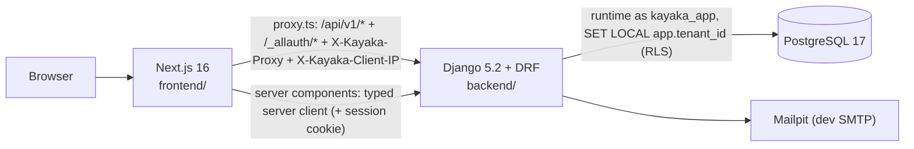
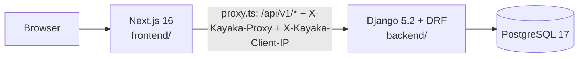

# Architecture overview (as built)

The full target architecture is in [blueprint.md](blueprint.md), and decisions are in
[../adr](../adr/README.md). This page describes **what exists today** and is updated at the end
of every phase.

## Current phase: 2 — Identity, access & tenancy

Phase 2 adds authentication (django-allauth headless, sessions), the tenant and membership
models, permission-code RBAC, and the PostgreSQL row-level-security foundation. See the
[identity & tenancy guide](../development/identity-and-tenancy.md),
[ADR 0010](../adr/0010-rbac-and-tenant-context.md) and
[ADR 0011](../adr/0011-allauth-headless-via-proxy.md). No business modules yet (catalog,
inquiries, customers, analytics are later phases).

### Phase 2 additions

| Package | Contents |
|---|---|
| `kayaka.authorization` | Permission codes + registry; `TenantRole`/`PlatformRole` enums; role → permission maps. No models, no cross-module imports. |
| `kayaka.accounts` | Adds `PlatformRoleAssignment` (explicit platform roles, separate from `is_staff`). |
| `kayaka.tenancy` | `Tenant`, `Membership`, `TenantScopedModel`, `AuditLogEntry`; transaction-local tenant context (`db.py`) + RLS SQL (`rls.py`); membership-aware `access.py`; DRF permission classes; identity/tenancy API; `seed_demo_data`. |

New tables: `tenants`, `memberships`, `platform_role_assignments`, `audit_log_entries` (RLS-anchored),
plus allauth/sites tables. API: `/api/v1/me`, `/api/v1/tenants[/{id}]`, `/api/v1/tenants/switch`,
`/api/v1/platform/overview`, `/api/v1/auth/csrf`, and allauth's `/_allauth/browser/v1/*`.

Import boundary (import-linter): `tenancy` → `accounts` → `authorization` → `core` (high → low).

### Phase 1 foundation (unchanged)

### Backend (`backend/`)

| Package | Contents |
|---|---|
| `config/` | Settings (`base`, `dev`, `test`, `prod`), root URLs, `/api/v1` router, WSGI/ASGI |
| `kayaka.core` | Error envelope + DRF exception handler, JSON error handlers for non-DRF views, request ID, trusted-proxy client IP, access log, security headers, JSON logging, UUIDv7 helper, `/healthz`, `/readyz`, `GET /api/v1/public/ping` |
| `kayaka.accounts` | Custom `User` model (UUIDv7 PK, email login, case-insensitive unique email) + `PlatformRoleAssignment`. |

As of Phase 2 the identity/tenancy tables exist (`tenants`, `memberships`,
`platform_role_assignments`, `audit_log_entries`). **No business tables yet** (catalog,
inquiries, customers, analytics are later phases).

### Frontend (`frontend/`)

| Route group | URL | Purpose |
|---|---|---|
| `(marketing)` | `/` | Landing experience + API status (server → API); Sign in CTA |
| `(auth)` | `/login` | Polished login (email + password via allauth headless) |
| `(storefront)` | `/store/[storeSlug]` | Mobile-first demo store shell; invalid slugs → store not-found |
| `(dashboard)` | `/dashboard` | Auth-gated (redirects to `/login`); real identity, tenant switcher, user menu; demo metrics |
| `(admin)` | `/admin` | Auth-gated, platform-role-only (tenant users → `/dashboard`); demo metrics |

Auth helpers: `src/lib/auth` (`server.ts` server-side `getServerMe`, `client.ts` browser
login/logout/switch, `types.ts`), and `src/components/auth` (`UserMenu`, `TenantSwitcher`).

Shared code: `src/components/ui` (shadcn primitives), `src/components/shared`, and `src/lib`
(env validation, typed API clients, proxy header logic).

### Request paths verified in Phase 1

| Path | How | Proven by |
|---|---|---|
| Server component → Django | `serverApi` (openapi-fetch) with `X-Kayaka-Proxy` | E2E: home/admin show "API connected" |
| Browser → `proxy.ts` → Django | `browserApi`, relative `/api/v1/*` | E2E: dashboard status + response headers |
| Unknown API URL | Django catch-all → JSON `NOT_FOUND` envelope | Backend + E2E tests |
| Invalid store slug | `notFound()` in the store layout → `store/not-found.tsx` (real 404) | E2E |

When proxying, the forwarded `Host` is the API's own host (the original host is in
`X-Forwarded-Host`), so Django's `ALLOWED_HOSTS` only needs the API host.

### Module boundaries enforced now

- `kayaka.core` imports no other Kayaka module (`import-linter` layers contract).
- Kayaka modules never import `config` (settings come via `django.conf.settings`).
- Storefront code can't import dashboard/admin code, and vice versa (ESLint `no-restricted-imports`).
