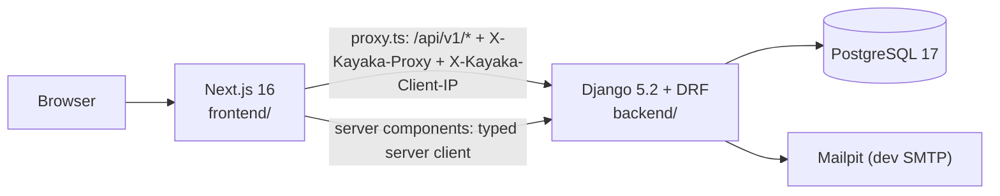

# Architecture overview (as built)

The full target architecture is in [blueprint.md](blueprint.md), and decisions are in
[../adr](../adr/README.md). This page describes **what exists today** and is updated at the end
of every phase.

## Current phase: 1 — Foundation / walking skeleton

### Backend (`backend/`)

| Package | Contents |
|---|---|
| `config/` | Settings (`base`, `dev`, `test`, `prod`), root URLs, `/api/v1` router, WSGI/ASGI |
| `kayaka.core` | Error envelope + DRF exception handler, JSON error handlers for non-DRF views, request ID, trusted-proxy client IP, access log, security headers, JSON logging, UUIDv7 helper, `/healthz`, `/readyz`, `GET /api/v1/public/ping` |
| `kayaka.accounts` | Custom `User` model (UUIDv7 PK, email login, case-insensitive unique email). No API yet. |

Only the user tables (plus Django's built-in auth, contenttypes, and session tables) exist.
**No tenant or business tables exist yet.** They start in Phase 2, after the DB role split and RLS.

### Frontend (`frontend/`)

| Route group | URL | Purpose in Phase 1 |
|---|---|---|
| `(marketing)` | `/` | Landing placeholder + API status (server → API) |
| `(storefront)` | `/store/[storeSlug]` | Mobile-first store shell (header, main, footer); invalid slugs → store not-found |
| `(dashboard)` | `/dashboard` | Responsive shell (sidebar on desktop, bottom nav on mobile) + API status via proxy (browser → proxy → API) |
| `(admin)` | `/admin` | Dense admin shell |

Shared code: `src/components/ui` (shadcn primitives), `src/components/shared`, and `src/lib`
(env validation, typed API clients, proxy header logic).

### Request paths verified in Phase 1

| Path | How | Proven by |
|---|---|---|
| Server component → Django | `serverApi` (openapi-fetch) with `X-Kayaka-Proxy` | E2E: home/admin show "API connected" |
| Browser → `proxy.ts` → Django | `browserApi`, relative `/api/v1/*` | E2E: dashboard status + response headers |
| Unknown API URL | Django catch-all → JSON `NOT_FOUND` envelope | Backend + E2E tests |
| Invalid store slug | `notFound()` in the store layout → `store/not-found.tsx` (real 404) | E2E |

When proxying, the forwarded `Host` is the API's own host (the original host is in
`X-Forwarded-Host`), so Django's `ALLOWED_HOSTS` only needs the API host.

### Module boundaries enforced now

- `kayaka.core` imports no other Kayaka module (`import-linter` layers contract).
- Kayaka modules never import `config` (settings come via `django.conf.settings`).
- Storefront code can't import dashboard/admin code, and vice versa (ESLint `no-restricted-imports`).
