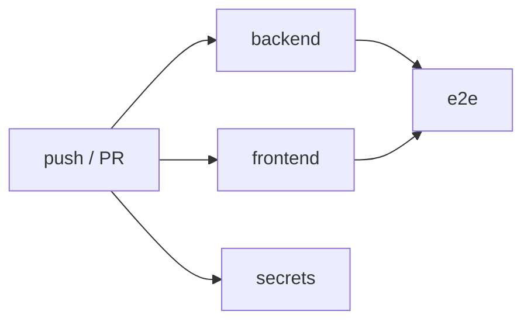

# Continuous integration

Workflow: [`.github/workflows/ci.yml`](../../.github/workflows/ci.yml). It runs on every pull
request and on pushes to `main`.

| Job | Steps | Fails when |
|---|---|---|
| **backend** | uv sync (locked) → ruff lint → ruff format → import-linter → mypy → `makemigrations --check` → `check --deploy` (prod settings) → pytest (Postgres 17 service) → OpenAPI export + diff | Lint/type/boundary errors, missing migration, insecure prod settings, failing tests, stale `openapi/schema.json` |
| **frontend** | npm ci → ESLint → Prettier → `next typegen` + tsc → regenerate API types + diff → Vitest → `next build` | Lint/format/type errors, stale `schema.d.ts`, failing tests, build errors |
| **e2e** | `docker compose up --build --wait` → npm ci → Playwright Chromium → `next build` → Playwright (desktop + mobile) | Any smoke scenario fails (report uploaded as an artifact) |
| **secrets** | gitleaks over the full git history | A committed secret |

Supply-chain hygiene:
- Actions are pinned to commit SHAs (tag in a trailing comment).
- `uv.lock` and `package-lock.json` are committed. CI installs with `--locked` / `npm ci`.
- Dependabot ([`.github/dependabot.yml`](../../.github/dependabot.yml)) proposes weekly updates for
  uv, npm, Docker images, Compose images, and Actions.

## Status

As of the end of Phase 1, every job's steps have been run locally in clean containers (Python
3.14.7 + uv 0.12.21; Node 24.21 + npm 11.19), and the workflow passes `actionlint`. The workflow
has **not yet run on GitHub**, because the repository has no remote yet. The first push is the
real confirmation.

## Recommended branch protection (once on GitHub)

Require the `backend`, `frontend`, `e2e`, and `secrets` checks on `main`; require PRs; block
force-pushes.
